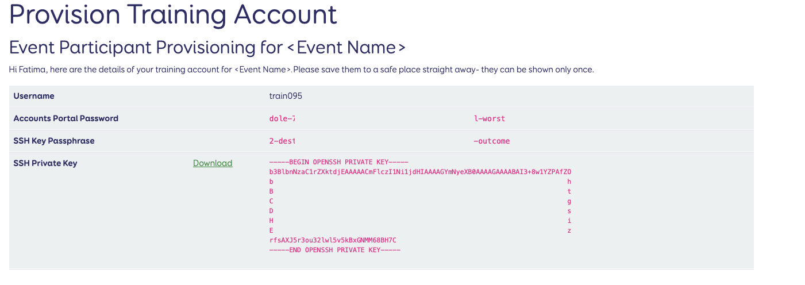

## Introduction

This exercise is for participants of JASMIN Workshop training events.

It helps you set up your computer with the software and training account credentials needed to undertake the exercises in the workshop.

> [!NOTE]
> For the [reasons explained below](#own-vs-training-account), we provide workshop participants with a temporary training account for the duration of the workshop event. Even if you have your own JASMIN account, please use the training account for the workshop event.

Please also see the set of [FAQs](#faq) at the end of this page.

## Instructions

These instructions are in 3 parts:

1. Common instructions to obtain your training account credentials
2. Specific instructions (for the computer you have in front of you) to set up your environment
3. Testing your connection

Let's get started...

## 1. Common instructions: downloading credentials

(Click the arrow to expand the set of instructions)

<details>
   <summary id="downloading">Downloading the credentials sent to your registered email</summary>

   - Locate the email sent by the JASMIN Accounts Portal. It should have `[jasmin-accounts] JASMIN Training Account Created` in the subject line.
      - If you can't find the email, search for this subject in your emails, but also check your spam/junk folders before asking for help.
   - Follow the link in the email from the JASMIN Team to provision your account on the JASMIN Accounts Portal.
   - Please note, **this is a one-time link**. If you close the tab after clicking the link **your credentials will be lost**, even if you click on the link in the email again.
   - You should reach a page showing four important parts of your training account, like the image below.
   
   
   - Open a plain-text editor (e.g. Notepad on Windows, TextEdit on Mac) and paste these first three details into a text file to keep them safe:
      - Username
      - Accounts Portal Password
      - SSH Key Passphrase
   - Click the "Download" link next to the SSH Private Key. It will save the private key as `id_ecdsa` without a file extension - please don't rename it, unless you have already used SSH and have an SSH keypair with the same name.
   - Keep this file in your Downloads folder for now.

</details>

## 2. Specific instructions: setting up your environment

Below, you will find instructions specific to Windows, Mac and Linux. However the same overall process applies to each, i.e:

   ```mermaid
   flowchart TD
      id1(Store your key locally) 
      --> id2(Load private key into SSH client software)
      --> id3(Use SSH client to connect to remote host)
   ```

Each of the methods involves using a piece of software which provides a "terminal" environment on your computer.

- For Mac and Linux, you should be able to use tools already available on your local machine.
- For Windows, you should have the "OpenSSH Client" already available as an "optional feature". If not, you may need to either install this or alternative software to provide the environment you need to connect using SSH.

This software usually includes an "SSH Agent" which stores your private key, once you've unlocked it with the passphrase, then makes it available for making a connection to a remote computer (like a JASMIN login node).

Click the arrows to expand the relevant sets of instructions.

> [!NOTE]
> Copy any commands carefully: some are case-sensitive.

<!--

Replace these sections below with link to instructions here?

https://help.jasmin.ac.uk/docs/getting-started/present-ssh-key/

-->

<details>

   <summary id="windows">Windows instructions: option 1</summary>

   If you use this option, other services will be easier to use later on. But look at option 2 if you think that looks easier for now.

   - Check that the right tools are installed
     - Open a PowerShell window using "run as administrator"
     - Run this command to check whether you have "OpenSSH Client" optional feature installed.
       ```powershell
       Get-WindowsCapability -Online | Where-Object Name -like 'OpenSSH.Client*'
       ```
       If it's installed, continue. If not, either ask for help, or choose option 2.

   - Check that the directory `.ssh` exists within your user directory:
     ```powershell
     ls "$env:UserProfile\.ssh"
     ```
     If it exists, you'll get a list of the files currently there. If not, create it with:
     ```powershell
     md "$env:UserProfile\.ssh"
     ```
     then move the file `id_ecdsa` key file from the Downloads folder to this directory.
     ```powershell
     mv "$env:UserProfile\Downloads\id_ecdsa" "$env:UserProfile\.ssh\"
     ```
   - Open the text file with the credentials you saved in Part 1: you'll need them shortly.
   - Check that the `ssh-agent` service is running
     ```powershell
     Get-Service ssh-agent
     ```
     If it's not, start it:
     ```powershell
     Set-Service ssh-agent -StartupType Manual
     Start-Service ssh-agent
     ```
   - Load your key into the agent
     ```powershell
     ssh-add "$env:UserProfile\.ssh\id_ecdsa"
     ```
     You'll be asked for the passphrase from the credentials: copy and paste this (right-click in the PowerShell window, the text will not be displayed), then press return.
   - Check that you have your key loaded.
     ```powershell
     ssh-add -l
     ```
     You should see your key in the list of identities.

</details>

<details>

   <summary id="windows">Windows instructions: option 2</summary>

   - Locate the `id_ecdsa` private key file from the Downloads folder.
     - don't try to open the `id_ecdsa` file: it's not meant to be readable.
   - Open the text file with the credentials you saved in Part 1: you'll need them shortly.

   - Download and install "MobaXterm"
   
     This is an emulator of the terminal environment (Mac and Linux have this environment built-in), and provides the tools you need to connect. There are other options, but we'd recommend this one if you want us to help you with any problems.

     - Go to https://mobaxterm.mobatek.net/
       - go to [Download](https://mobaxterm.mobatek.net/download.html)
       - choose the "Home edition", then "Download now"
       - Choose the **installer edition**
       - right-click the downloaded zip file and choose "extract all"
       - run the installer, then follow the instructions.

   - Open MobaXterm, and follow the steps in this video to load your private key and check it's loaded in a terminal session.
     - [](https://youtu.be/qm8PcD24Xsc)

</details>

<details>
  <summary>Mac or Linux instructions</summary>

  In the Mac or Linux environments, it's best to put your SSH-related files in a standard place. This is a directory called `.ssh` in your home directory (the `.` means it's hidden).

  - open the text file with the credentials you saved in Part 1: you'll need them shortly.
  - open the `Terminal` utility (use the search in the top menu bar to find this if you haven't used it before)
  - this should open a command-line terminal, starting in your home directory. The shorthand for your home directory is `~/`

  Check if you have a directory `~/.ssh` already:

  ```
  ls ~/.ssh
  ```

  If this exists already, the `ls` command will list its contents (it could be empty, that's fine).

  If you see `No such file or directory`, make this directory with the command:

  ```
  mkdir -p ~/.ssh
  ```
  and set permissions on it so that it's only read/writable by you:
  ```
  chmod 700 ~/.ssh
  ```

  Now, move the SSH private key `id_ecdsa` from your download location (where your browser puts downloaded files) to the directory you just created.

  ```
  mv ~/Downloads/id_ecdsa ~/.ssh/
  ```

  Set the permissions on this file to be only read/writable by you:

  ```
  chmod 600 ~/.ssh/id_ecdsa
  ```

  Now, check whether you have an SSH-agent running:

  ```
  ssh-add -l
  ```

  If you see
  ```
  The agent has no identities.
  ```

  that's fine: it's running, but just doesn't have any keys loaded yet. Skip the step below.

  If you see `Could not open a connection to your authentication agent` or `Error connecting to agent` this means you haven't got one running, so you need to start one with the following command:

  ```
  eval $(ssh-agent -s)
  ```

  You're now able to load your private key, as follows:

  ```
  ssh-add ~/.ssh/id_ecdsa
  ```

  You will be prompted for your passphrase: don't try and type it in, copy and paste it from credentials file which you should have open in a text editor. You can usually paste with <kbd>Cmd (⌘)</kbd>+<kbd>V</kbd> on Mac, <kbd>CTRL</kbd>+<kbd>V</kbd> on Linux, or by right-clicking and choosing "Paste", but this may vary depending on your system and terminal.

  Be careful not to copy any whitespace either side of the passphrase.
  
  Note that the terminal does not echo back any characters or placeholders for a passphrase. So don't paste it again just because it's not displaying!

  Now, check with the `ssh-add -l` command as before, and the key fingerprint should be displayed, e.g.

   ```
   ssh-add -l
   521 SHA256:ZeddNKK5U3am1vyCaUCq4CgMRpvoyv+cJiviqz3zvfw ~/.ssh/id_ecdsa (ECDSA)
   ```

   If you don't see this, go back and check the steps above carefully before asking for help.

</details>

## 3. Test your connection

First, check that your key is loaded:

```bash
ssh-add -l
```

You should see your key fingerprint, i.e. something like this:

```
521 SHA256:ZeddNKK5U3am1vyCaUCq4CgMRpvoyv+cJiviqz3zvfw ~/.ssh/id_ecdsa (ECDSA)
```

Now try a connection to `login-01.jasmin.ac.uk`, replacing `USERNAME` with the name of your training account:
   
> [!IMPORTANT]
> Don't forget the `-A` option for "agent forwarding". This makes your key available to any onward connections you need to make, after connecting to the login node.

```bash
ssh -A USERNAME@login-01.jasmin.ac.uk
```

Once you have connected, try `ssh-add -l` again as above, to check that your key is available for an onward connection.

### Success?

If:
- you have successfully logged in to the login server
- you have your key available for an onward connection as above

...then you're all set, and you're ready for the rest of the exercises in the workshop.

If not, check through the FAQ below, and make sure you've done everything as per the instructions and videos, then if you're still having trouble, please ask for help.

## FAQ

(Click the arrow to expand each FAQ)

<details>

   <summary id="own-vs-training-account">

   #### Can I use my own JASMIN account?

   </summary>

   For the JASMIN workshop training events, we prefer that you use the supplied training accounts.

   This is because we have pre-configured each training account with access roles for all the resources you need for the training workshop, including:
    - the `workshop` group workspace
    - the `workshop` LOTUS queue (for responsive wait times during workshops)
    - a corresponding CEDA Archive account with access to certain datasets used in the exercises

   We cannot configure all these resources on a temporary basis, so ask you to use the training account during events. You are welcome to transfer over any data created during a workshop, to your own account (but beware there is a time limit for this, before training accounts are wiped: ask your course organiser for details).

</details>

<details>

   <summary>
   
   #### I haven't received my account credentials
   
   </summary>

   - make sure you are checking in the email account which you gave to the course organisers: the training account will be set up with this email address.
   - make sure you have searched for "JASMIN Training Account" in your email application.
   - make sure you have checked your spam/junk folders.
   - ask your course organiser for help if you still can't find it: it should be possible to get it re-sent.

</details>

<!-- We can delete this if training account credentials no longer provide the public key -->
<!-- <details>

   <summary>
   
   #### I can't open the <code>*.pub</code> file when I double-click it (on Windows)
   
   </summary>

   That's OK. It's not a file that you need to open. The `.pub` file extension is sometimes recognised by Windows as a Microsoft Publisher file, but this one isn't: it's your public key (part of your public/private key pair).

</details> -->

<details>

   <summary>
   
   #### Message about "unprotected key"
   
   </summary>

   If you see a message like the following, this means that you need to restrict the permissions on your key file so that only you (and no other users on your system) can read your key.
   This is usually solved by:
   - a) moving the file to the standard location (this matters, particularly on Windows) and
   - b) changing its permissions.

   ```
   @@@@@@@@@@@@@@@@@@@@@@@@@@@@@@@@@@@@@@@@@@@@@@@@@@@@@@@@@@@
   @         WARNING: UNPROTECTED PRIVATE KEY FILE!          @
   @@@@@@@@@@@@@@@@@@@@@@@@@@@@@@@@@@@@@@@@@@@@@@@@@@@@@@@@@@@
   Permissions 0644 for 'id_ecdsa' are too open.
   It is required that your private key files are NOT accessible by others.
   This private key will be ignored.

   ```

   Please see [these instructions on the JASMIN help site](https://help.jasmin.ac.uk/docs/getting-started/present-ssh-key/#unprotected-private-key-file) about solving this problem.
   

   
</details>

<details>
  <summary>
  
  #### Message "Agent refused connection"
  
  </summary>

  This isn't necessarily a problem.

  If the output of `ssh-add -l` is something like the examples above in the Windows or Mac/Linux instructions, showing your key fingerprint, then you should still be good to go.
</details>

<details>
  <summary>
  
  #### Message "Could not open a connection to your authentication agent" or "Error connecting to agent: No such file or directory"
  
  </summary>

  This means that you don't have an SSH-agent running, so there isn't an agent to load your key into.

  For Windows/MobaXterm, review the setup video to make sure you've got the key loaded correctly.


  For Mac/Linux, you may need to run the following command to start the agent:

   ```
   eval $(ssh-agent -s)
   ```

   You should see output similar to this:

   ```
   agent pid 1234
   ```

   Then try loading your key again with the ssh-add command:

   ```
   ssh-add <path to your key>
   ```

   and enter the passphrase when prompted.

   For more detailed instructions, see also the [JASMIN Help page on this topic](https://help.jasmin.ac.uk/docs/getting-started/present-ssh-key/).

</details>
