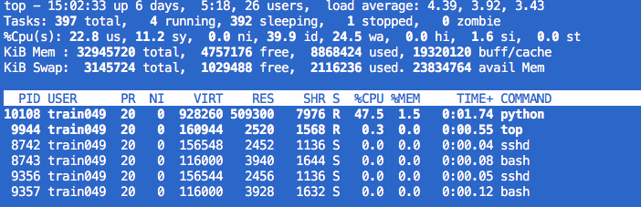
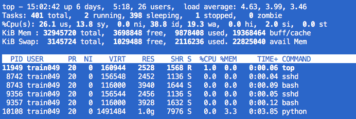
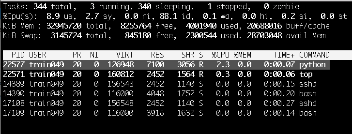
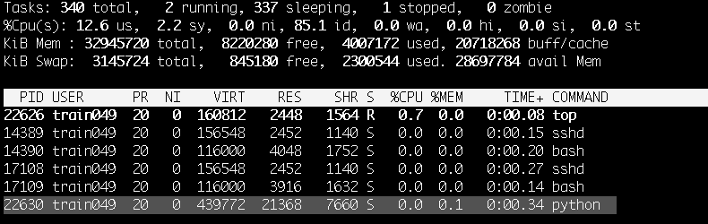
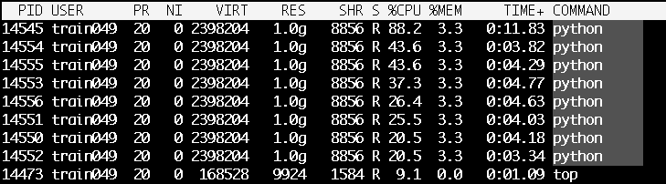
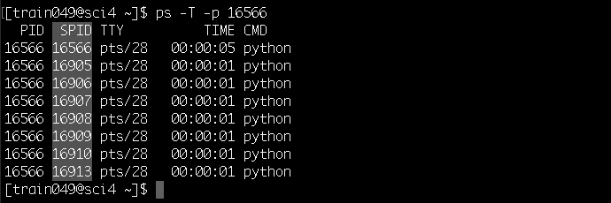
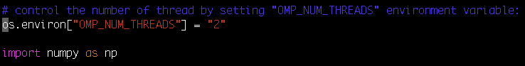
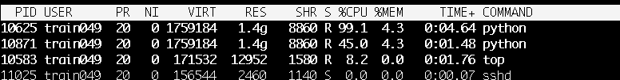

# Exercise 2: Interactive computing on a sci server

### Scenario

I need to do a random sampling of my dataset to estimate the distribution of sample mean. I need to use the random number generator function available in the `numpy` library in Python. I need to test this function.

### Objectives

After completing this exercise I will be able to:

- **execute** a computing task on the sci machine from a command line
- **monitor** CPU and memory resources usage of my computing task
- **understand** the modules environemnt e.g. JASPY and software on JASMIN
- **learn** about the capabilities and limitations of the scientific analysis servers

### JASMIN resources

- Scientific analysis servers: `sci-vm-0[1-6].jasmin.ac.uk`, `sci-ph-0[12].jasmin.ac.uk`
- Group workspace: `/gws/pw/j07/workshop`
- Example Python scripts are provided:
  - `/gws/pw/j07/workshop/exercises/ex02/code/random-number-gen.py`
  - `/gws/pw/j07/workshop/exercises/ex02/code/dot-product-2arrays.py`
- help documentation at https://help.jasmin.ac.uk

### Local resources

 * SSH key & passphrase
 * Terminal application
 * A valid `jasmin-login` grant associated with your JASMIN account

### Your task

This is the outline of what you need to do. The recommended way of doing each step is covered in the "Cheat Sheet" but you may wish to try solving it for yourself first.

1. Your starting point is on a JASMIN `login` server (see [exercise 01](../ex01))
1. Login to a JASMIN scientific analysis server from the login server
   - Launch two terminal sessions
   - Access a JASMIN login server on each terminal (see exercise 01)
   - Choose a sci server with low load
   - Login to the chosen sci server in both terminal sessions
   > **_NOTE:_**  The purpose of having two SSH terminal sessions running on the same sci server is to facilitate compute and monitoring. One terminal is for executing commands on the sci while the second terminal is for monitoring user processes (or editing a script)
1. Execute the first Python example script on the sci server
   - Copy the first Python example script `random-number-gen.py`(shown in the JASMIN resources section) to your current working directory
   - Find out the software available on JASMIN via the module environment by executing the command `module avail`
   - Enable a Python environemnt using the `jaspy` module by executing the command `module add jaspy`
   - Execute the command `python random-number-gen.py`
   - Check the process ID (pid), state, memory and CPU usage on the monitoring terminal
   - What is the CPU and memory used by the process during Run and Sleep state?
1. Monitor your processes on the sci machine
   - Execute the Linux command `top -u <username>`
   - How many processes do you have?
   - Sort all processes per CPU usage by executing `top`
   - To exit the monitoring tool `top` press the keyboard letter `q`
   - Try another utility to list all your processes on the sci server `ps -aux | grep <username>`
1. Make changes to the Python example and re-execute it
   - Open the Python script file in a text editor e.g. vim, emacs -See note below-
   - Decrease the size of the random numbers `nran`from 1024 to 500
   - Save the file and exit the text editor
   - Execute `python random-number-gen.py`
   - Monitor and note the memory and CPU usage
   - Compare the CPU and memory resources used to generate 1024 and 500 random numbers. What can you conclude?
    > **_NOTE:_**  If you are not familiar with using either `vim` or `emacs` editors, just run the following command which does the necessary change for you: (changing the quantity of random numbers)
    ```
    sed -i 's/nran = 1024/nran = 500/' random-number-gen.py
    ```

### Questions to test yourself

All too easy? Here are some questions to test your knowledge an understanding. You might find the answers by exploring the [JASMIN Documentation](https://help.jasmin.ac.uk)

1. Is there a limit on the number of processes running on the sci server at any given time by a user?
1. What tasks are not suitable to run on the sci servers?
1. What software is available via the module environment?
1. How do you switch between different version of a software module?
1. What text editors are available on JASMIN?
1. Can I install software on JASMIN?

### Review / alternative approaches / best practice

You will be able to run and test a script on the scientific analysis servers. You will be able to monitor the resources used by your script. You can scale up by using the high-memory scientific sci[3,6,8].jasmin.ac.uk server for testing and then move your workflow to the batch cluster LOTUS.

What tasks I can not run on the Sci server?

- Do not run processes with execution time over two hours
- Do not run parallel applications e.g. MPI or OpenMP, high threaded codes on the Sci servers
- Do not run data transfer processes on the sci servers. Please use a transfer server e.g. `xfer-vm-01.jasmin.ac.uk` (Except when moving data from `/work/scratch-pw[2,3]` to a GWS because `/work/scratch-pw[2,3]` are not mounted on the `xfer` servers)
- Use the high memory scientific analysis servers `sci-ph-0[12].jasmin.ac.uk` for testing high memory or multithreaded code
- Only test multi-threaded code on the high memory servers and limit the number of threads
- It is necessary to consider moving a processing task to the batch system LOTUS when the resource demand is high, e.g. CPU, memory and processing time

Manage your processes on the Sci server

- If a process hangs, do not simply close the terminal window. Please contact the helpdesk and alert the team so that the process can be shut down. Otherwise hung processes build up and contribute to machine overloading.
- Many instances of an application e.g., Ipython, can impact the performance of the scientific servers. 
- Monitor the CPU and memory resources of your processes 
- You might use STOP and CONT to delay execution of a process until a less-busy time like this: `kill -STOP <pid>`, `kill  -CONT <pid>` or kill the process `Kill -TERM <pid>`
- Do not “hog” IDL development licenses on the Sci servers. A limited number of these are available for development and compilation of IDL code which should then be run on LOTUS using IDL runtime licenses, of which there are many more

Usage of the storage:

- Do not use `/tmp` on the scientific servers. Using /tmp can cause the scientifiec analysis server to crash, resulting in loss of work. Set the environment variable TMPDIR to a temporary directory under a GWS area- `export TMPDIR=/GWS-path/<your_project>/<your_username>/tmp`
- Do not generate huge numbers of files (>1000) in a single directory
- The user home directory `/home/users/<username>` has a fixed quota of 100 GB
- Manage your disk usage space regularly, e.g. delete unused files and archive files using the `tar` command

### Cheat Sheet

1. Login to a JASMIN scientific analysis server

   - Login to the chosen sci server from a JASMIN login server

   ```bash
   $ ssh -A <username>@sci<number>.jasmin.ac.uk
   ```

   For example the user `train049` connects to `sci-vm-01`:

   ```bash
   $ ssh -A train049@sci-vm-01.jasmin.ac.uk
   [train049@sci-vm-01 ~]$
   ```

1. Change directory to the workshop GWS, and make a directory for your username under `users`:

   ```bash
   $ cd /gws/pw/j07/workshop/users
   $ mkdir $USER
   ```

   (the `$USER` environment variable is be populated with your actual username e.g. `train049`, but using the variable here means you can copy & paste the command and it should work the same for everyone).

1. Make a directory here for this exercise, and change to that directory
   ```bash
   $ mkdir ex02
   $ cd ex02
   ```

1. Copy the example Python script to this directory
   ```bash
   $ cp /gws/pw/j07/workshop/exercises/ex02/code/random-number-gen.py .
   ```

1. Execute the Python example script on the sci server

   - Enable a Python environemnt via the module `jaspy` by executing  the command `module add jaspy`

   ```bash
   $ module add jaspy
   $ module list
   Currently Loaded Modulefiles:
     1) jaspy/3.11/v20240815
   ```

   - Execute the Python script `python random-number-gen.py`

   ```bash
   $ python random-number-gen.py
   Get ready to monitor PID 10108
   1024 ======>>> random numbers
   Process 17203 is in sleep mode for 10 sec check its resources usage in this state
   Finished in 3.316218542982824 seconds  
   ```

   - Check the process ID `PID`, state `S`, memory `%MEM%`and CPU `%CPU`usage on the monitoring terminal from the interactive `top` command:

   ```bash
   $ top -u <username> 
   ```

1. Monitor your processes on the sci server
   - Execute the Linux command `top -u <username>`

   ```bash
   $ top -u <username>
   ```
   
   

   - Which process is running? give the process ID

      The process ID  and its state are shown in the 1st column `PID` and  8th column `S`, respectively. Python process with PID 10108 is in Sleep state but still using 3.3 %MEM which is 1 GB of the physical/resident memory `RES` (6th column)

   - Sort all processes per CPU usage Execute `top` 
   ```bash
   $ top 
       No screenshot to avoid displaying usernames of logged on users 
   ```
   - To exit the monitoring tool `top` press the keyboard letter `q`

1. Make changes to the Python example and re-execute it
   * Open the Python script file in a text editor e.g. vim, emacs
   ```bash
   $ vim random-number-gen.py
   ```
   - Decrease the size of the random numbers `nran` from `1024` to `500`

   ```python
   # Import Python libraries numpy, time and os
   import numpy as np
   import time
   import os

   # Get the Process Identifier  of the current process
   PID=os.getpid()
   print("Process ID %s (PID) started" %(os.getpid()))
   print("Get ready to monitor PID", PID)
   # Wait for tsleep  
   tsleep= 5
   time.sleep(tsleep)

   # Number of random numbers to be generated 
   nran = 500 # <- CHANGED

   # Generate a random number from the normal distribution
   t1 = time.perf_counter()
   result = [np.random.bytes(nran*nran) for x in range(nran)]
   ```
  
   - Save the file and exit the text editor `vim`. Press "Esc" then

   ```
   :wq
   ```

   * Execute `python random-number-gen.py`

   ```bash
   $ python random-number-gen.py
   500 ======>>> random numbers
   I am sleeping for 40 seconds so you can check the resources usage
   ```

   - Monitor and note the memory and CPU usage

   ```bash
   $top -u <username>
   ```
    
    

     - What can you conclude?   
     The Python process used less CPU and memory to generate and store `nran=500` in memory compared to `nran=1024`

### Answers to questions

> 1. Is there a limit on the number of processes running on the sci server at any given time by a user?

There is no limit on the number of processes launched by a user on the scientific analysis servers. However, the user should limit the number of processes to a maximum of 2 as the sci server is shared by other users. Distribute the processing tasks across other Sci servers and consider moving the tasks to the batch cluster LOTUS.

> 2. What tasks are not suitable to run on the Sci servers?

 Long-running tasks and heavy processing, MPI parallel codes and multithreaded applications 

> 3. What software is available via the module environment?

JASPY, jasmin_sci, Intel/GNU compiler, NetCDF library, NAG libray and IDL(Restricted)

> 4. How do you switch between different version of a software module?

Here is an example of using the command "module switch" to enable a different version of Python:

```
$ module add jaspy
$ python --version
Python 3.11.9

```
Now, we'll switch to a different version of JASPY to enable Python 3.10 
```
$ module switch jaspy/3.11 jaspy/3.10

The following have been reloaded with a version change:
  1) jaspy/3.11/v20240815 => jaspy/3.10/r20230718

$ python --version
Python 3.10.8
```

> 5. What text editor or IDE are available on JASMIN?

Emacs, vim, nedit, geany and nano


> 6. Can I install software on JASMIN?                                
   - You can install software under your home directory for your own use. 
   - If you need to share a software environment with other JASMIN users and the software licence allows it then enquire on "small files" Group Workspace by contacting the JASMIN support helpdesk.
   - You **cannot** do actions which require `sudo` or `su` (elevated privileges)

### Further learning (optional)

#### Beware of implicit multithreading

This additional section shows how multithreading can occur, which can result in mamy more processes than you intended, running on the sci server. Learn how to be aware of this and how to disable it.

Your task: Test for a potential multithreading

- Copy the second Python example script (shown in the JASMIN resources section) to your current working directory 
- Remove the default JASPY environment (jaspy/3.10/r20220721) then enable the JASPY version (jaspy/3.7/20210320) for this task
- Execute the command `python dot-product-2arrays.py`
- On the monitoring terminal execute the command  `top -H -u <username>` or `ps -T -p <pid>`
- How many threads the process spawned?
- Set the environment variable `OMP_NUM_THREADS` to one thread (or two if you wish) by executing the command `export OMP_NUM_THREADS=1` 
- Re-execute `python dot-product-2arrays.py`
- Did the setting `OMP_NUM_THREADS=1` disable multithreading?
- Edit the script in a text editor and uncomment the line of code `#os.environ[“OMP_NUM_THREADS”] = “2"` and save the script 
- Rerun the Python script
- What can you conclude?
- Logout from the sci machine

Cheat-sheet: Test for a potential multithreading

   * Copy the second Python example script (shown in the JASMIN resources section) to your current working directory 
   ```
   $ cp /gws/pw/j07/workshop/exercises/ex02/code/dot-product-2arrays.py .
   ```
   * Remove the default JASPY environment (jaspy/3.11/v20240815)then enable the JASPY version jaspy/3.10/v20230718 for this task
   ```
   $ module rm jaspy 
   $ module add jaspy/3.10/v20230718
   ```
   or switch module using the command
   ```
    module switch jaspy/3.11/v20240815 jaspy/3.10/v20230718
   ```
   * Execute the command `python dot-product-2arrays.py`
   ```
   $ module add jaspy
   $ python dot-product-2arrays.py
   Process 14545 started
   Time with None threads: 15.869181 s
   Finished in 15.869181300047785 seconds
   ```
      Note: the variable `echo $OMP_NUM_THREADS` is not set. Hence, the message above 'None threads'
   * On the monitoring terminal execute the command  `top -H -u <username>` or `ps -T -p <pid>`
   
   using the `ps -T -p <pid>` 
   
   * How many threads the process spawned?
   7 threads with the master process e.g. PID 16566 as shown in the example above. 

   * Set the environment variable `OMP_NUM_THREADS` to 1 by executing the command `export OMP_NUM_THREADS=1`
   ```
   $ export OMP_NUM_THREADS=1  
   $ echo $OMP_NUM_THREADS
   1
   ```

   * Re-execute `python dot-product-2arrays.py`
   ```
   $ python dot-product-2arrays.py
   Process 1838 started
   Time with 1 threads: 14.571710 s
   Finished in 14.571709612966515 seconds
   ```
   * Did the setting `OMP_NUM_THREADS=1` disable multithreading?
   Yes, the setting of `OMP_NUM_THREADS=1` disabled multithreading. There is only a single process and no threads
   
   * Edit the script in a text editor and uncomment the line of code `#os.environ[“OMP_NUM_THREADS”] = “2"` and save the script or use the command 'sed':
   ```
   sed -i 's/#os.environ/os.environ/'  dot-product-2arrays.py
   ```
   
    Note: This setting must be done before numpy import -see screenshot above.
   * Rerun the Python script 
   ```
   $ python dot-product-2arrays.py
   Process 10625 started
   Time with 2 threads: 13.889903 s
   Finished in 13.889903239090927 seconds
   ```
   
   * What can you conclude?
     There is one process PID 10625 and one threads with SPID 10871.
     The setting of `os.environ["OMP_NUM_THREADS"] = "2"` from the Python script overrides the setting from the SHELL.

   * Logout from the sci machine to end your SSH session on JASMIN sci

    ```
   $ logout
   Connection to sci-vm-<number>.jasmin.ac.uk closed.
    ```