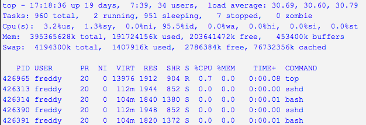
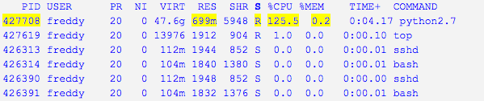
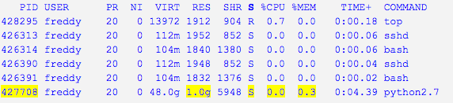
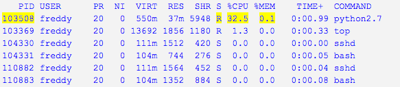

# Exercise 2: Interactive computing on a sci server

### Scenario

I need to do a random sampling of my dataset to estimate the distribution of sample mean. I need to use the random number generator function available in the numpy library in Python. I need to test this function. I also need to check if there is a potential multithreading with Numpy array arithmetic e.g. dot product.

### Objectives 

After completing this exercise I will be able to:
* **execute** a computing task on the sci machine from a command line
 * **monitor** CPU and memory resources usage of my computing task
 * **understand** the modules environemnt e.g. JASPY and software on JASMIN
 * **become aware** of implicit multithreading and how to disable it
 * **learn** about the capabilities and limitations of the scientific analysis servers
 
 ### JASMIN resources

 * Scientific analysis servers: `sci[1-6].jasmin.ac.uk`
 * Group workspace: `/gws/pw/j05/workshop`
 * Python example scripts are provided: 
 `/gws/pw/j05/workshop/exercises/ex02/code/random-number-gen.py`
 `/gws/pw/j05/workshop/exercises/ex02/code/dot-product-2arrays.py`

### Local resources

 * SSH key & passphrase 
 * Terminal application or NX client
 * A valid `jasmin-login` grant associated with your JASMIN account 

### Videos
You can follow this exercise by watching the videos below, or by following the text of this article, or a combination of both.
|  |  |
| --- | --- |
| Task | [](https://www.youtube.com/watch?v=_09pMUX6fLQ) |
| Solutions & Discussion | coming soon |

### Your task

This is the outline of what you need to do. The recommended way of doing each step is covered in the "Cheat Sheet" but you may wish to try solving it for yourself first.

1. Login to a JASMIN scientific analysis server 
   * Launch two terminal sessions
   * Access a JASMIN login server on each terminal (see exercise 01)
   * Choose a Sci server with the lowest load 
   * Login to the chosen sci server on each terminal                   
   > **_NOTE:_**  The purpose of having two SSH terminal sessions running on the same sci server is to facilitate compute and monitoring. One terminal is for executing commands on the sci while the second terminal is for monitoring user processes (or editing a script)
1. Execute the first Python example script on the sci machine
   * Copy the first Python example script `random-number-gen.py`(shown in the JASMIN resources section) to your current working directory
   * Find out the software available on JASMIN via the module environment by executing the command `module avail`
   * Enable a Python environemnt via the module `jaspy` by executing  the command `module add jaspy`
   * Execute the command `python random-number-gen.py` 
   * Check the process ID (pid), state, memory and CPU usage on the monitoring terminal
   * What is the CPU and memory used by the process during Run and Sleep state?
1. Monitor your processes on the sci machine
   * Execute the Linux command `top -u <username>` 
   * How many processes do you have?
   * Sort all processes per CPU usage by executing `top` 
   * To exit the monitoring tool `top` press the keyboard letter `q` 
   * Try another utility to list all your processes on the sci `ps -aux | grep <username>`
1. Make changes to the Python example and re-execute it
   * Open the Python script file in a text editor e.g. vim, emacs
   * Decrease the size of the random numbers `nran`from 1024 to 500
   * Save the file and exit the text editor
   * Execute `python random-number-gen.py`
   * Monitor and note the memory and CPU usage 
   * Compare the CPU and memory resources used to generate 1024 and 500 random numbers. What can you conclude?
1. Test for a potential multithreading
   * Copy the second Python example script (shown in the JASMIN resources section) to your current working directory 
   * Execute the command `python dot-product-2arrays.py`
   * On the monitoring terminal execute `top -H -u <username>`
   * How many threads the process spawned?
   * Set the environment variable `OMP_NUM_THREAD` to 1 by executing the command `export OMP_NUM_THREAD=1`
   * Re-execute `python dot-product-2arrays.py`
   * Did the setting `OMP_NUM_THREAD=1` disable multithreading?
   * Edit the script in a text editor by uncommenting the line of code `#os.environ[“OMP_NUM_THREADS”] = “2"` and rerun the script
   * What can you conclude?
   * Logout from the sci machine to end your SSH session on JASMIN sci

### Questions to test yourself

All too easy? Here are some questions to test your knowledge an understanding. You might find the answers by exploring the [JASMIN Documentation](https://help.jasmin.ac.uk)

1. Is there a limit on the number of processes running on the sci server at any given time per a user?
1. What software is available via the module environment?
1. How to switch between different version of a software module e.g. `jaspy`?
1. Is the `jasmin-sci` module different to `jaspy`?
1. What tasks are not suitable to run on the sci machines?
1. How to limit the number of threads?
1. What text editors are available on JASMIN?
1. Can I install software on JASMIN?

### Review / alternative approaches / best practice

You will be able to run a Python script on the scientific analysis servers. You will be able to monitor the resources used by your script on the scientific analysis servers. You can scale up by using the high-memory scientific sci[3,6,8].jasmin.ac.uk server for a large set of random numbers

* Do not run processes with execution time over two hours
* Do not use `/tmp` on the scientific servers and transfer servers. Using /tmp can cause the scientific analysis server to crash, resulting in loss of work. Set the environment variable TMPDIR to a temporary directory under a GWS area- `export TMPDIR=/GWS-path/<your_project>/<your_username>/tmp`
* Do not generate huge numbers of files (>1000) in a single directory
* Do not run data transfer processes on the scientific analysis servers. Please use `xfer[1,2].jasmin.ac.uk` (Except when moving data from `/work/scratch-pw` to a GWS because `/work/scratch-pw` is not mounted on the `xfer` servers)

* Do not run parallel applications e.g. MPI or OpenMP, high threaded codes on the scientific analysis servers 
* Use the high memory scientific analysis servers `sci[3,6,8].jasmin.ac.uk` for testing high memory and/or multithreaded code (sci3 (48 CPUs, 1000GB RAM), sci8 (24 CPUs, 384GB RAM))
* Limit the number of threads when testing a multithreaded code on the scientific analysis servers
* Many instances of an application e.g., Ipython or IDL  can impact the performance of the scientific servers. Please note that for IDL, we have a large pool of run-time licences and a much more limited pool of development licences.
* It is necessary to consider moving a processing task to the batch system LOTUS when the resources demand is high.  


https://help.jasmin.ac.uk/article/121-sci-servers 
https://help.jasmin.ac.uk/article/176-storage   

### Cheat Sheet

1. Login to a JASMIN scientific analysis server
   * Login to the chosen sci server from a JASMIN login server
   ```
   $ ssh -A sci<number>.jasmin.ac.uk
   ```
1. Execute the Python example script on the sci 
   * Copy the Python example script (shown in the JASMIN resources section) to your current working directory 
   ```
   $ cp /gws/pw/j05/workshop/exercises/ex02/src/random-number-gen.py .
   ```
   * Enable a Python environemnt via the module `jaspy` by executing  the command `module add jaspy`
   ```
   $ module add jaspy
   $ module list
   Currently Loaded Modulefiles:
     1) jaspy/3.7/r20200606
   ```
   * Execute the Python script `python random-number-gen.py` 
   ```
   $ python random-number-gen.py
   1024  ======>>> random numbers
   I am sleeping for 40 seconds so you can check the resources usage   
   ```
   * Check the process ID (pid), state, memory and CPU usage on the monitoring terminal

   * How many random numbers did the `random-number-gen.py` generate?
   ```
   1024  ======>>> random numbers
   ```
1. Monitor your processes on the sci server
   * Execute the Linux command `top -u <username>` 
   ```
   $ top -u <username>
   ```
   
   
   
   * Which process is running? give the process ID
   ```
   $ ps -u <username>

   ```
   * Sort all processes per CPU usage Execute `top` 
   ```
   $ top 
    insert a table or an image ???
   ```
   * To exit the monitoring tool `top` press the keyboard letter `q` 
1. Make changes to the Python example and re-execute it
   * Open the Python script file in a text editor e.g. vim, emacs
   ```
   $ vim random-number-gen.py
   ```
   * Decrease the size of the random numbers from 1024 to 500
   ```
   # Number of random numbers to be generated 
   nran = 1024
   ```
   * Save the file and exit the text editor 
   ```
   :wq
   ```
1. Compare the compute resources to generate the set 1024 and 500 random number 
   * Execute `python random-number-gen.py`
   ```
   $ python random-number-gen.py
   500 ======>>> random numbers
   I am sleeping for 40 seconds so you can check the resources usage
   ```
   * Monitor and note the memory and CPU usage 
   ```
   $top -u <username>
   ```
   
     * What can you conclude?   
The process's memory usage was reduced by 70 %
1. Logout from the sci server to end your SSH session on JASMIN 
```
$ logout
Connection to sci<number>.jasmin.ac.uk closed.   
```
### Answers to questions

> 1. Is there a limit on the number of processes running on the sci server at any given time per a user?

There is no limit on the number of processes launched by a user on the scientific anaylsis servers. However, the user should limit the number of processes to a minimum 2 as the resource is shared by other users.

> 2. What software is available via module environment?

JASPY, jasmin_sci, Intel/GNU compiler, NetCDF library, IDL.

> 3. What tasks are not suitable to run on the sci machines?

MPI parallel codes and multithreaded applications 

> 4. What text editor or IDE are available on JASMIN?

Emacs, vim, nedit, geany, ferret

> 5. Can I install software on JASMIN?

You can install software in the user home directory if the software licence allows it

