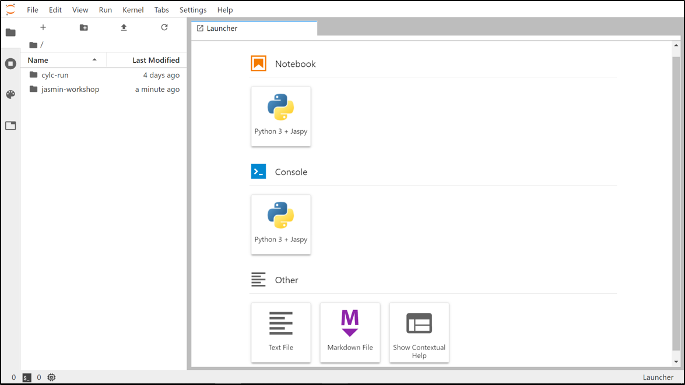
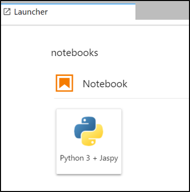
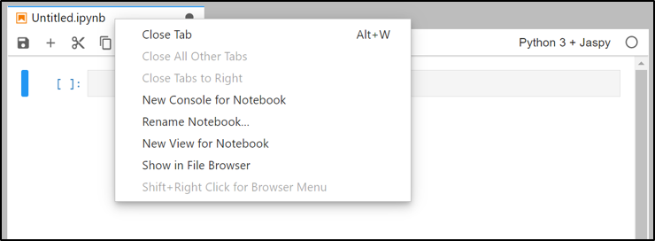
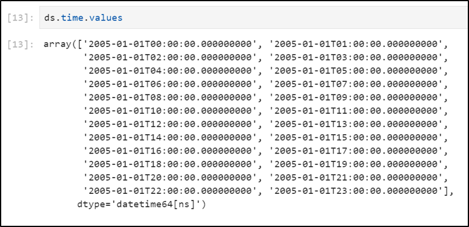
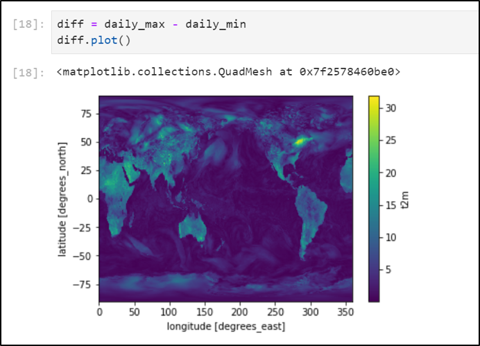
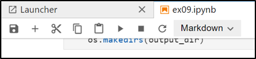
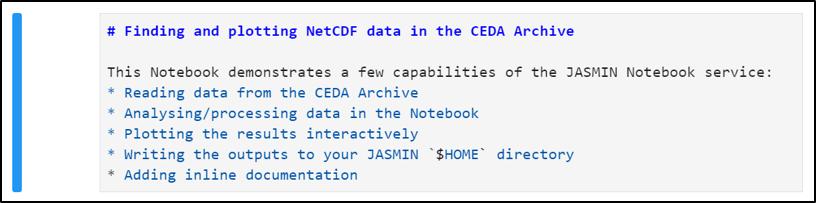
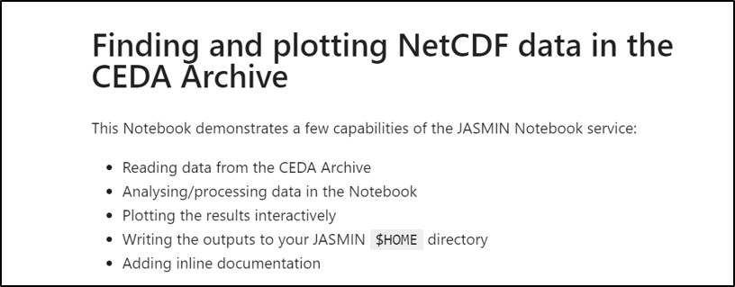
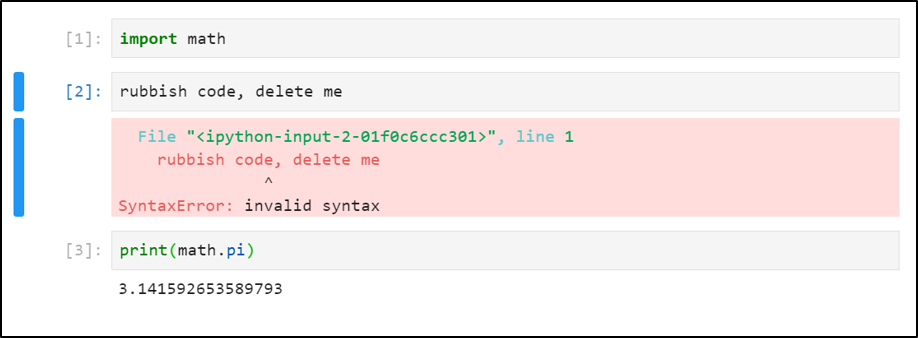

# Exercise 09: Using Jupyter Notebooks on JASMIN

### Scenario

I want to demonstrate how data in the CEDA Archive can be read, processed and
visualised using the an interactive Jupyter Notebook. The JASMIN Notebook Service:
* provides an interactive programming interface through a web browser
* includes a set of python libraries for data analysis
* can read directly from the CEDA Archive
* can include formatted documentation and visualisations within a Notebook 

Specifically, I want to:
* read some hourly temperature data from the ECMWF ERA5 dataset on a global grid
* calculate the daily maximum and minimum over the time axis (all hours)
* plot the global maps of the daily maximum and minimum variables
* write the outputs to netCDF files on JASMIN
* add some inline annotations

### Objectives
 
After completing this exercise I will be able to:

 * login to the JASMIN Notebook Service
 * create a Jupyter Notebook
 * import modules and run Python code interactively using a notebook
 * create visualisations in a notebook
 * write outputs to the JASMIN file system
 * add inline annotations to a notebook

### JASMIN resources

 * JASMIN account with `jasmin-login` privilege
 * JASMIN Notebook Service: https://notebooks.jasmin.ac.uk
 * Help documentation at: https://help.jasmin.ac.uk/article/4851-jasmin-notebook-service

### Local resources

* Web browser (such as `Firefox`, `Chrome`, `Safari`)

### Your task

This is the outline of what you need to do. The recommended way of doing each step is covered in the "Cheat Sheet" but you may wish to try solving it for yourself first.

 1. Login to the JASMIN Notebook Service in your browser
 2. Create a new Notebook
 3. Import the `xarray` module and load some surface temperature data from 01/01/2005
 4. Review the content of the loaded `Dataset`
 5. Calculate the max and min over all timesteps in the dataset
 6. Plot the daily maximum and minimum
 7. Write the outputs to your JASMIN `$HOME` directory
 8. Add inline documentation

### Questions to test yourself

All too easy? Here are some questions to test your knowledge an understanding. You might find the answers by exploring the [JASMIN Documentation](https://help.jasmin.ac.uk)

 1. How can you add extra software packages to your Notebook?
 2. How can you set up and use an entirely separate `conda` environment in your Notebook?
 3. Can you figure out how to:
    * Delete a cell from a notebook
    * Execute a cell with different outcomes

### Review / alternative approaches / best practice

This exercise demonstrates how to:
 1. Get started with the JASMIN Notebook Service
 2. Import and use software packages in your notebooks
 3. Read and write from/to the JASMIN file system
 4. View the outputs inline
 5. Add annotations inline

Alternative approaches could include:

 1. Using other Notebooks services, for example:
    * Google Colaboratory: https://colab.research.google.com/
    * Binder: https://mybinder.org/

 2. Sharing your code on github:
    * You can view notebooks directly in GitHub
    * Here is an example: https://github.com/cedadev/ceda-notebooks/blob/master/notebooks/data-notebooks/cmip6/cmip6-zarr-jasmin.ipynb

Learn more about our Notebook Service:
 * Tutorial (in notebooks): https://github.com/cedadev/ceda-notebooks/blob/master/notebooks/training/intro/notebook-tour.ipynb
 * Help pages: https://help.jasmin.ac.uk/article/4851-jasmin-notebook-service

### Cheat Sheet

1. Login to the JASMIN Notebook Service in your browser

   Visit: https://notebooks.jasmin.ac.uk/

   It should look like this:

   

2. Create a new Notebook

   On the "Launcher" page, click the "Python 3 + Jaspy" button.

   

   Right-click on the "Untitled.ipynb" tab at the top of the notebook and rename it to:
   `ex09_notebook.ipynb`

   
   
3. Import the `xarray` module and load some surface temperature data from 01/01/2005

   This task involves two parts: (1) Finding the relevant ECMWF ERA5 file paths and (2) 
   Reading a file path pattern into an xarray Dataset object.

   Part (1) can be done in various ways. For the sake of simplicity, we have already 
   searched the CEDA catalogue and found this dataset record:

   https://catalogue.ceda.ac.uk/uuid/8aa70a91378d455ea63a2a1953858a7f

   Following the "Download" link (when logged in with your CEDA account) on the page 
   reveals a browseable data path that shows the 2-metre temperature data can be found 
   under:

   https://data.ceda.ac.uk/badc/ecmwf-era51/data/oper/an_sfc/2005/01/01 
   (e.g. file: `ecmwf-era51_oper_an_sfc_200501010000.2t.nc`)

   On the file system, this translates to this pattern:

   ```
   /badc/ecmwf-era51/data/oper/an_sfc/2005/01/01/ecmwf-era51_oper_an_sfc_20050101*.2t.nc
   ```

   Click in the first cell of the notebook, and type:

       import xarray as xr

   Click `Alt+Enter` to execute the contents of the cell and create a new cell underneath.

   In the second cell, define the file pattern and open the netCDF files as an `xarray Dataset` with:

       file_pattern = "/badc/ecmwf-era51/data/oper/an_sfc/2005/01/01/ecmwf-era51_oper_an_sfc_20050101*.2t.nc"
       ds = xr.open_mfdataset(file_pattern)

   Click `Alt+Enter` to execute the contents of the cell and create a new cell underneath.
   From now on, remember that you need to click `Alt+Enter` to execute each cell.
   
4. Review the content of the loaded `Dataset`
   
   Notebooks are interactive, so you can look at the structure, attributes and time values 
   of the `Dataset`, by typing each of these in a separate cell and executing them:

       # view the dataset structure
       ds

       # `ds.t2m` accesses the 2-metre temperature variable, `attrs` gives its attributes
       ds.t2m.attrs

       # view the time values
       ds.time.values

   The latter should look like:

   

5. Calculate the max and min over all timesteps in the dataset
   
   You can access the 2-metre temperature variable using: `ds.t2m`

   The `ds.t2m` Dataset has its own methods: `max()` and `min()`. They require the argument `axis=0` 
   in order to specify calculating the max and min only over the time axis. Calculate two new 
   variables:

       daily_max = ds.t2m.max(axis=0)
       daily_min = ds.t2m.min(axis=0)

   Check the `shape` attribute of the `daily_max` and `daily_min` variables to ensure they are 2D 
   (i.e. time has been removed).

       daily_max.shape, daily_min.shape
   
6. Plot the daily maximum and minimum

   Typically, in a Notebook environment, you need this line before trying to view plots inline.

       %matplotlib inline

   The `daily_max` and `daily_min` variables now both have a `plot()` method. You can plot each of them 
   individually.

       daily_max.plot()

   ...and...

       daily_min.plot()

   You can even plot a map of the difference between them with:

       diff = daily_max - daily_min
       diff.plot()

   This should look like:

   
   
7. Write the outputs to your JASMIN `$HOME` directory

   The JASMIN Notebook Service can also see your JASMIN `$HOME` directory. You can write your
   outputs there (as long as they are not *too big!*).

   Create an `outputs` directory in your `$HOME` directory

       import os
       output_dir = f"{os.environ['HOME']}/outputs"

       if not os.path.isdir(output_dir):
           os.makedirs(output_dir)

   Write the `daily_max` and `daily_min` variables to NetCDF files, using the `to_netcdf()` method on 
   each variable. The method requires the output file path as the argument.

       daily_max.to_netcdf(f"{output_dir}/max_t2m.nc")
       daily_min.to_netcdf(f"{output_dir}/min_t2m.nc")
   
8. Add inline documentation

   One of the most powerful features of Jupyter Notebooks is that you can _explain your working_.
   That is, you can include documentation cells along with the code and the results.

   For each cell, you can select either "Code", "Markdown" or "Raw" in the toolbar at the top of the 
   notebook. If you select "Markdown", then the cell is no longer interpreted as Python code. Instead, 
   it is interpreted as a mark-up language called `markdown`. This allows sophisticated formatting of 
   text, images, code blocks etc., as described here:

   https://guides.github.com/features/mastering-markdown/

   In order to add Markdown cells to an existing notebook, click on the cell above the one you wish to 
   annotate, then click the `+` button on the toolbar. Then change the cell format to "Markdown" in the 
   drop-down menu.

   

   Once you have completed the content, press `Shift+Enter` to see the formatted version. If you need to edit a formatted cell, just double-click into it.

   Here is an example cell shown first in `markdown` format...

   

   ...and now formatted (after execution)...

   

### Answers to questions

> 1. How can you add extra software packages to your Notebook?

See this example notebook to create your own `virtual environment` to install
extra packages into your `$HOME` directory for use in a notebook:

https://github.com/cedadev/ceda-notebooks/blob/master/notebooks/training/virtualenvs-on-jasmin.ipynb

> 2. How can you set up and use an entirely separate `conda` environment in your Notebook?

See this example notebook to create new `conda` environments and make them visible
to the JASMIN Notebook Service when you select a _kernel_:

https://github.com/cedadev/ceda-notebooks/blob/master/notebooks/docs/add_conda_envs.ipynb

> 3. Can you figure out how to:
>  * Delete a cell from a notebook

To delete a cell, select the cell by clicking to the left of it (i.e. by `[2]` in the image below)



Once the cell is selected, press "dd" on the keyboard and the cell will disappear.

>  * Execute a cell with different outcomes

You can control what happens when you execute a cell, as follows:
 * `Shift+Enter` - which executes the cell and moves to the next one.
                   If there isn't one below, it creates a new one for you.
 * `Ctrl+Enter`  - which executes the cell (and stays focussed on the current cell).
 * `Alt+Enter`   - which executes the cell and creates a new one for you.

Clicking the `+` button in the toolbar will insert an empty cell below the currently selected cell.
