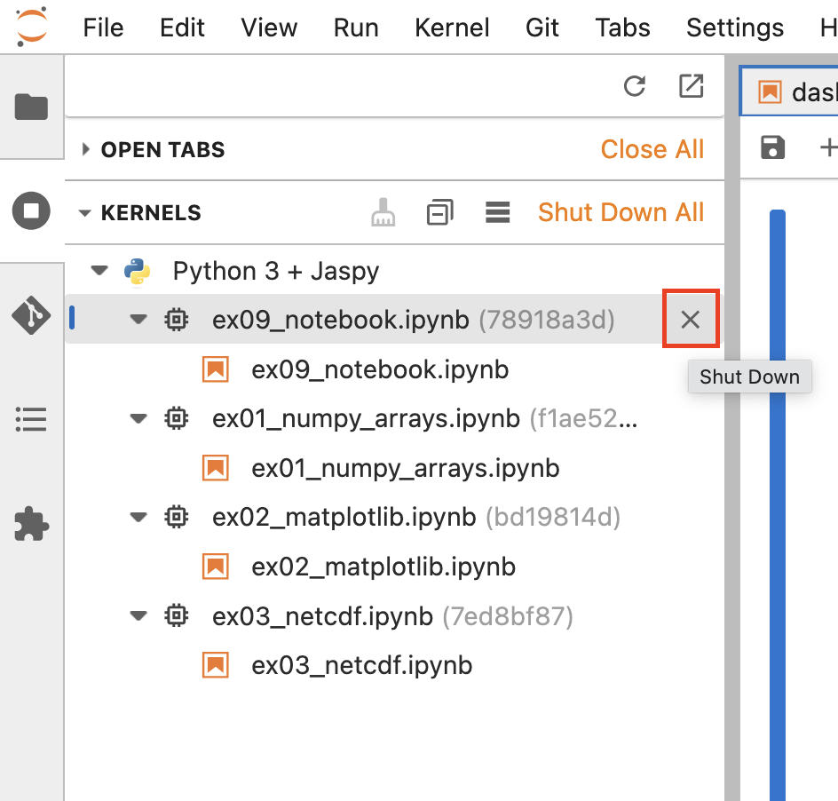
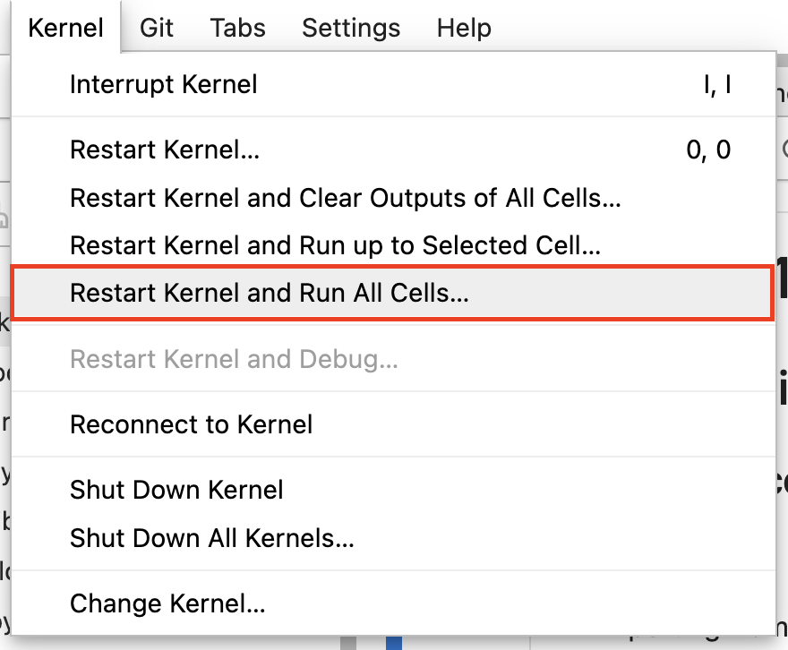
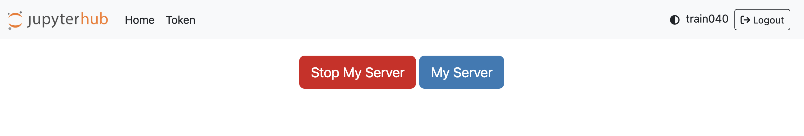

# Exercise 09: Using Jupyter Notebooks on JASMIN

### Scenario

I want to demonstrate how data in the CEDA Archive can be read, processed and
visualised using an interactive Jupyter Notebook.

The JASMIN Notebook Service:

- provides an interactive programming interface through a web browser
- includes a set of Python libraries for data analysis
- can read directly from the CEDA Archive
- can include formatted documentation and visualisations within a Notebook

Specifically, I want to:

- read some hourly temperature data from the ECMWF ERA5 dataset on a global grid
- calculate the daily maximum and minimum over the time axis (all hours)
- plot the global maps of the daily maximum and minimum variables
- write the outputs to netCDF files on JASMIN
- add some inline annotations

### Objectives

After completing this exercise I will be able to:

- login to the JASMIN Notebook Service
- create a Jupyter Notebook
- import modules and run Python code interactively using a notebook
- create visualisations in a notebook
- write outputs to the JASMIN file system
- add inline annotations to a notebook

### JASMIN resources

- A JASMIN account with `jasmin-login` privilege (already set up for training accounts)
- The [JASMIN Notebook Service](https://notebooks.jasmin.ac.uk)
- [Help documentation for the Notebook Service](https://help.jasmin.ac.uk/docs/interactive-computing/jasmin-notebooks-service/)

> [!NOTE]
> If you are using one of our training accounts rather than your own JASMIN account, you will need to use the ["Forgotten password"](https://accounts.jasmin.ac.uk/account/password_reset/) function of the JASMIN Accounts Portal to set a password on your training account. The training accounts do not have a password set on them, by default. Any confirmation emails will be sent to the address which you provided to the event organiser for use with your training account.

### Local resources

- Web browser (such as Firefox, Chrome, Safari)

### Your task

This is the outline of what you need to do. The recommended way of doing each step is covered in the "Cheat Sheet" but you may wish to try solving it for yourself first.

1. Login to the JASMIN Notebook Service in your browser
2. Create a new Notebook
3. Import the `xarray` module and load some surface temperature data from 01/01/2005
4. Review the content of the loaded `Dataset`
5. Calculate the max and min over all timesteps in the dataset
6. Plot the daily maximum and minimum
7. Write the outputs to your JASMIN `$HOME` directory
8. Add inline documentation

### Questions to test yourself

All too easy? Here are some questions to test your knowledge an understanding. You might find the answers by exploring the [JASMIN Documentation](https://help.jasmin.ac.uk).

1. How can you add extra software packages to your Notebook?

2. Can you figure out how to:

    - Delete a cell from a notebook
    - Execute a cell with different outcomes

### Review / alternative approaches / best practice

This exercise demonstrates how to:

1. Get started with the JASMIN Notebook Service
2. Import and use software packages in your notebooks
3. Read and write from/to the JASMIN file system
4. View the outputs inline
5. Add annotations inline

Alternative approaches could include:

1. Using other Notebooks services, for example:

    - [Google Colaboratory](https://colab.research.google.com/)
    - [Binder](https://mybinder.org/)

2. Sharing your code on GitHub:

    - You can view notebooks directly in GitHub.
    - [Here](https://github.com/cedadev/ceda-notebooks/blob/master/notebooks/data-notebooks/cmip6/cmip6-zarr-jasmin.ipynb) is an example from our CEDA Notebooks repository demonstrating CEDA data and tools.

#### Best practice

##### Shutting down notebooks after use
- Each time you open a new `.ipynb` Jupyter Notebook, the Notebook Service starts a new Python kernel to run any cells you click "play" on.
- However when you close a notebook (by pressing the `x` on the tab), the kernel will remain running in the background.
- We recommend shutting down these kernels in the sidebar (see the screenshot below) as they can take up memory as you keep opening new notebooks and slow your other notebooks down.


##### Restarting notebooks
- You might find that you try running a cell, nothing happens, or it never finishes running for some reason.
- In this case you can try restarting the kernel by choosing "Kernel > Restart Kernel..." in the menu at the top of the page, then click Restart in the pop up.
- When you press this, the message in the status bar at the bottom of the screen will say "Python 3 + Jaspy | Restarting/Unknown/Busy" while the kernel loads, then it will say "Python 3 + Jaspy | Idle" when it is ready to use again.
- You can even choose "Kernel > Restart Kernel and Run All Cells..." to restart the kernel and get back to the very last cell at the bottom of the notebook.


##### Restarting your JupyterHub server
- If you've tried restarting your kernel, opening a new notebook, refreshing the page and you still can't get the Notebook to work, you can restart your JupyterHub server.
- To do this, in the File menu choose "Hub Control Panel" to return to the home page of the JASMIN Notebook Service.

- Here you can press "Stop My Server", wait a few seconds, then press "Start My Server" to get a fresh JupyterHub server. It will redirect you but you can close this tab to get back to what you were working on.

Learn more about our Notebook Service:

  - [Tutorial (in notebooks)](https://github.com/cedadev/ceda-notebooks/blob/master/notebooks/training/intro/notebook-tour.ipynb)
  - [Help pages about the Notebook Service](https://github.com/cedadev/ceda-notebooks/blob/master/notebooks/training/intro/notebook-tour.ipynb)

Learn more about the kinds of Python libraries for data and visualisation that work really well with the Notebook Service:
- [NCAS Introduction to Scientific Computing - Working with Data module](https://github.com/ncasuk/ncas-isc/#python---working-with-data) - lessons and Jupyter Notebook exercises to practice

### Cheat Sheet

1. Log into the JASMIN Notebook Service in your browser

   Visit: https://notebooks.jasmin.ac.uk/

   It should look like this:

   

2. Create a new Notebook

   On the "Launcher" page, click the "Python 3 + Jaspy" button.

   

   Right-click on the "Untitled.ipynb" tab at the top of the notebook and rename it to:
   `ex09_notebook.ipynb`

   
   
3. Import the `xarray` module and load some surface temperature data from 01/01/2005

   This task involves two parts: (1) Finding the relevant ECMWF ERA5 file paths and (2) 
   Reading a file path pattern into an `xarray` Dataset object.

   Part (1) can be done in various ways. For the sake of simplicity, we have already 
   searched the CEDA catalogue and found [this dataset record](https://catalogue.ceda.ac.uk/uuid/8aa70a91378d455ea63a2a1953858a7f).

   On that catalogue page, following the "Download" link (when logged in with your CEDA account) or the "Explore" link (when logged out)
   reveals a browseable data path that shows the 2-metre temperature data can be found 
   under:

   https://data.ceda.ac.uk/badc/ecmwf-era51/data/oper/an_sfc/2005/01/01

   (Example file: `ecmwf-era51_oper_an_sfc_200501010000.2t.nc`)

   On the file system, this translates to this pattern:

   ```
   /badc/ecmwf-era51/data/oper/an_sfc/2005/01/01/ecmwf-era51_oper_an_sfc_20050101*.2t.nc
   ```

   Click in the first cell of the notebook, and type:

    ```python
    import xarray as xr
    ```

   Press <kbd>Alt</kbd>+<kbd>Enter</kbd> to execute the contents of the cell and create a new cell underneath. On Mac the shortcut is <kbd>Option (⌥)</kbd>+<kbd>Enter</kbd>.

   In the second cell, define the file pattern and open the netCDF files as an `xarray Dataset` with:

    ```python
    file_pattern = "/badc/ecmwf-era51/data/oper/an_sfc/2005/01/01/ecmwf-era51_oper_an_sfc_20050101*.2t.nc"
    ds = xr.open_mfdataset(file_pattern)
    ```

   Press <kbd>Alt</kbd>+<kbd>Enter</kbd> to execute the contents of the cell and create a new cell underneath.
   From now on, remember that you need to press <kbd>Alt</kbd>+<kbd>Enter</kbd> to execute each cell.
   
4. Review the content of the loaded `Dataset`
   
   Notebooks are interactive, so you can look at the structure, attributes and time values 
   of the `Dataset`, by typing each of these in a separate cell and executing them:

       # view the dataset structure
       ds

       # `ds.t2m` accesses the 2-metre temperature variable, `attrs` gives its attributes
       ds.t2m.attrs

       # view the time values
       ds.time.values

   The latter should look like:

   

5. Calculate the max and min over all timesteps in the dataset
   
   You can access the 2-metre temperature variable using: `ds.t2m`

   The `ds.t2m` Dataset has its own methods: `max()` and `min()`. They require the argument `axis=0` 
   in order to specify calculating the max and min only over the time axis. Calculate two new 
   variables:

    ```python
    daily_max = ds.t2m.max(axis=0)
    daily_min = ds.t2m.min(axis=0)
    ```

   Check the `shape` attribute of the `daily_max` and `daily_min` variables to ensure they are 2D 
   (i.e. time has been removed).

    ```python
    daily_max.shape, daily_min.shape
    ```
   
6. Plot the daily maximum and minimum

   Typically, in a Notebook environment, you need this line before trying to view plots inline. But you don't need to do this in the JASMIN Notebooks Service.

       %matplotlib inline

   The `daily_max` and `daily_min` variables now both have a `plot()` method. You can plot each of them 
   individually.

    ```python
    daily_max.plot()
    ```

   ...and...

    ```python
    daily_min.plot()
    ```

   You can even plot a map of the difference between them with:

    ```python
    diff = daily_max - daily_min
    diff.plot()
    ```

    This should look like:

    
   
7. Write the outputs to your JASMIN `$HOME` directory

   The JASMIN Notebook Service can also see your JASMIN `$HOME` directory. You can write your
   outputs there (as long as they are not *too big!*).

   Create an `outputs` directory in your `$HOME` directory

    ```python
    import os
    output_dir = f"{os.environ['HOME']}/outputs"

    if not os.path.isdir(output_dir):
        os.makedirs(output_dir)
    ```

   Write the `daily_max` and `daily_min` variables to NetCDF files, using the `to_netcdf()` method on 
   each variable. The method requires the output file path as the argument.

    ```python
    daily_max.to_netcdf(f"{output_dir}/max_t2m.nc")
    daily_min.to_netcdf(f"{output_dir}/min_t2m.nc")
    ```
   
8. Add inline documentation

   One of the most powerful features of Jupyter Notebooks is that you can _explain your working_.
   That is, you can include documentation cells along with the code and the results.

   For each cell, you can select either "Code", "Markdown" or "Raw" in the toolbar at the top of the
   notebook. If you select "Markdown", then the cell is no longer interpreted as Python code. Instead,
   it is interpreted as a mark-up language called `markdown`. This allows sophisticated formatting of
   text, images, code blocks, etc.
   
   GitHub has a [documentation page](https://guides.github.com/features/mastering-markdown/) describing some of the main features you can use with Markdown.

   In order to add Markdown cells to an existing notebook, click on the cell above the one you wish to
   annotate, then click the `+` button on the toolbar. Then change the cell format to "Markdown" in the
   drop-down menu.

   

   Once you have completed the content, press <kbd>Shift</kbd>+<kbd>Enter</kbd> to see the formatted version. If you need to edit a formatted cell, just double-click into it.

   Here is an example cell shown first in `markdown` format...

   

   ...and now formatted (after execution)...

   

### Answers to questions

> 1. How can you add extra software packages to your Notebook?

This help article describes how to create your own `virtual environment` into 
which you can install extra packages, and optionally how to make it into a kernel for future re-use:

https://help.jasmin.ac.uk/article/5084-creating-a-virtual-environment-in-the-jasmin-notebooks-service

> 2. Can you figure out how to:
>  * Delete a cell from a notebook

To delete a cell, select the cell by clicking to the left of it (i.e. by `[2]` in the image below)


Once the cell is selected, press the <kbd>d</kbd> key twice on the keyboard and the cell will disappear.

>  * Execute a cell with different outcomes

You can control what happens when you execute a cell, as follows:
 * <kbd>Shift</kbd>+<kbd>Enter</kbd> - which executes the cell and moves to the next one. If there isn't one below, it creates a new one for you.
 * <kbd>Ctrl</kbd>+<kbd>Enter</kbd> - which executes the cell (and stays focussed on the current cell).
    * This is <kbd>Cmd (⌘)</kbd>+<kbd>Enter</kbd> on Mac.
 * <kbd>Alt</kbd>+<kbd>Enter</kbd> - which executes the cell and creates a new one for you.
    * This is <kbd>Option (⌥)</kbd>+<kbd>Enter</kbd> on Mac.

Clicking the `+` button in the toolbar will insert an empty cell below the currently selected cell.
