# Tutorial 02: Managing a multi-step workflow

### Scenario

I want to analyse a set of historical temperature records from weather stations in the UK. I am interested in calculating annual maximum temperatures for a randomly selected set of 10 counties. These are available from the publicly available "MIDAS-Open" data set in the CEDA archive. There are multiple steps to my workflow so I want to use a tool that (1) can work with LOTUS and (2) can handle dependencies (i.e. only run subsequent tasks if previous tasks have successfully completed).

I will read data from the MIDAS-Open dataset and aggregate all measurements (from all stations) into a time series of the annual maximum temperatures per county. Then plot a line graph to compare the annual maximum temperature from all counties and write it to a PNG file.

An example temperature file for a single station and year (in the MIDAS-Open data set) can be found at:

```bash
/badc/ukmo-midas-open/data/uk-daily-temperature-obs/dataset-version-201901/devon/01359_cheldon-barton/qc-version-1/midas-open_uk-daily-temperature-obs_dv-201901_devon_01359_cheldon-barton_qcv-1_1977.csv
```

This workflow will generate a graph of a time series of maximum temperature data that looks something like:

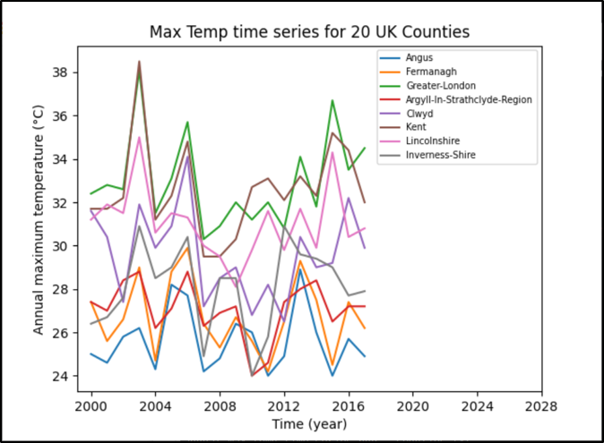

### Workflow context

This tutorial follows a classic "diamond" structure as follows:

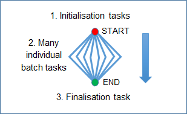

The **(1)** initialisation tasks must be completed first. 

The **(2)** individual batch tasks will then all run in parallel. 

When they have all completed then the **(3)** finalisation task can be executed.

The actual tasks are:

  1. **Initialisation**: Clone the repository to get the extraction scripts; run the first script to generate a list of UK counties; write those to a text file.

  2. **Batch**: For each county: calculate a 2000-2017 time series of the annual maximum temperature across all stations.

  3. **Finalisation**: Read in all the time series files and plot them on a line graph to a PNG file.

It may help to sketch out the process in a simple diagram, as shown here...

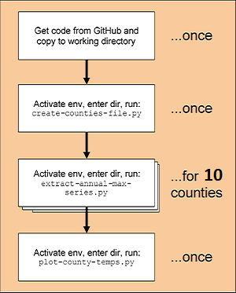

### Objectives
 
After completing this tutorial I will be able to:

 * break down a multi-step workflow into independent tasks
 * configure a basic Cylc job that includes a multi-step workflow
 * run the workflow on the `cylc` server on JASMIN
 * interact with the Cylc graphical user interface

### JASMIN resources

 * JASMIN account with SSH public key uploaded and `jasmin-login` privilege
 * login servers: `login.jasmin.ac.uk`
 * Cylc server: `cylc2.jasmin.ac.uk`
 * LOTUS batch processing cluster
 * GWS (read/write): `/gws/pw/j07/workshop`
 * `$HOME` directory
 * CEDA Archive (read-only): requires a CEDA account
 * help documentation at https://help.jasmin.ac.uk
 
### Local resources

* SSH client (to login to JASMIN)

### The task

This is the outline of the overall task. The recommended way of doing each step is covered in the "Walkthrough" below.

 1. The starting point is on a JASMIN `login` server (see [exercise 01](../ex01))
 1. SSH to the Cylc server (with the `-X` flag to forward X-windows)
 1. In this example you are given the building blocks to construct a "workflow file" for use with Cylc
 1. Wrap the scripts in a Cylc workflow by copying the example workflow to a new directory called `my-workflow` and modifying it
 1. Run the Cylc workflow
 1. If the workflow partially runs and leaves log/working directories in place you can clean these up and run it again
 1. If you need to stop the workflow then you can instruct Cylc to stop it

### Review / alternative approaches / best practice

Alternative approaches and good practice might include:
 * Manage the process yourself (without Cylc)?
 * Set the `$PATH` environment variable in your `~/.bash_profile`
 * Write your outputs somewhere else
 * *Have any files been accidentally left on the system?* (e.g. in: `/tmp/` etc)
 * Tidy up your run workflow directory (i.e. logs and task directories)
 * View the workflow graph of the workflow
 * Understand different modes of stopping a running workflow

### Walkthrough

1. The starting point is on the JASMIN `login` server (see [exercise 01](../ex01))

2. SSH to the Cylc server (with the `-X` flag to forward X-windows)
   
      ```
      ssh -X cylc2
      ```

3. In this example you are given the building blocks to construct a "flow file" for use with Cylc

  * Script 1: `create-counties-file.py`
    1. Context: Python 3
    2. Inputs: None - script locates county directories in the CEDA Archive
    3. Outputs:
       * File: `./outputs/counties.txt`

  * Script 2: `extract-annual-max-series.py`
    1. Context: Python 3
    2. Inputs: index - to select a county from the list (a number between 1 and 10)
    3. Outputs:
       * Files [10]: `./outputs/<county>.csv`

  * Script 3: `plot-county-temps.py`
    1. Context: Python 3
    2. Inputs: None - script locates input data in the `./outputs/` directory
    3. Outputs:
       * File: `./outputs/annual-max-temp-time-series.png`

  * The scripts are available at:
    * On JASMIN: `/gws/pw/j07/workshop/tutorials/tut02/code/`
    * On github: https://github.com/cedadev/jasmin-workshop/tree/master/tutorials/tut02/code

4. Wrap the scripts in a Cylc workflow by copying the example workflow to a new directory called
   `my-workflow` and modifying it.

  * The example workflow is available at:

        /gws/pw/j07/workshop/tutorials/tut02/example-workflow

  * Go to the directory where you have copied the workflow.

    ```
    cd my-workflow
    ```

  * Update the SLURM configuration file in `flow.cylc` to use your own account.

    ```
    # In flow.cylc
    # Change:
    #   --account=jasmin-workshop
    # To:
    #   --account=<YOUR_ACCOUNT>
    ```

  * You can run the copied example workflow to view how it works, with:

    ```
    # Add the location of the cylc executables to $PATH
    export PATH=/apps/jasmin/metomi/bin:$PATH
    cylc validate .
    cylc install .
    cylc play my-workflow
    ```

    This is the same as running `cylc vip`

  * All of the scripts operate on input/output data in the relative directory: `./outputs`. It therefore makes sense to copy the Python scripts to the main workflow "run directory" and ensure that each task runs from that directory. The workflow run directory is specified by the Cylc environment variable: `$CYLC_WORKFLOW_RUN_DIR`.

    This variable is set for you by Cylc; a typical value would be `/home/users/$USER/cylc-run/my-workflow/run1`. Note that the current working directory for the individual steps is different for each step (for example `/home/users/$USER/cylc-run/my-workflow/run1/work/1/initialise` for the `initialise` step). For the workflow below, it is convenient for all steps to be run in the same directory, so the commands for each step will include changing directory to `$CYLC_WORKFLOW_RUN_DIR` before running the relevant script.

    Since the example workflow currently only uses `echo` placeholders, it does not generate any outputs yet.

  * To make the workflow do something useful with the Python scripts, you would normally edit the `flow.cylc` file as follows:
    * In the `[[runtime]]` section of the workflow file, modify each of the 4 processing steps as follows:

        * `[[initialise]]`
          1. Delete any existing `jasmin-workshop` sub-directory (in case the workflow has been run previously)
          2. Clone the GitHub repository: https://github.com/cedadev/jasmin-workshop
          3. Copy the files in the sub-directory `jasmin-workshop/tutorials/tut02/code/` to the workflow run directory at: `$CYLC_WORKFLOW_RUN_DIR`.

        * `[[step1]]`
          1. Delete any existing `outputs` sub-directory (in case the workflow has been run previously)
          2. Activate the standard JASMIN Python 3 environment.
          3. Change directory to the `$CYLC_WORKFLOW_RUN_DIR`
          4. Run the script

        * `[[batch<counter>]]`
          1. Activate the standard JASMIN Python 3 environment.
          2. Change directory to the `$CYLC_WORKFLOW_RUN_DIR`
          3. Run the script for each value of the `counter`:
             * The `counter` variable is accessible by the environment variable: `CYLC_TASK_PARAM_counter`

        * `[[final]]`
          1. Activate the standard JASMIN Python 3 environment.
          2. Change directory to the `$CYLC_WORKFLOW_RUN_DIR`
          3. Run the script

  * **Instead of manually modifying the `my-workflow` configuration right now**, the repository already includes a fully configured workflow in the `workshop-workflow` directory that implements all of the above steps.

5. Run the fully configured `workshop-workflow`:

    ```
    # Add the location of the cylc executables to $PATH
    export PATH=/apps/jasmin/metomi/bin:$PATH
    cd workshop-workflow/
    # Remember to update the account in flow.cylc to <YOUR_ACCOUNT> as you did before.
    cylc vip .
    ```

  * **NOTE:** It will take a couple of minutes to start up. To view the workflow in action, open the GUI with:

6. If the workflow partially runs and leaves log/working directories in place you can clean these up and run it again with:

    ```
    cylc clean workshop-workflow
    cylc vip .
    ```

7. If you need to stop the workflow then you can instruct Cylc to stop it with:
   
    ```
    cylc stop '<WORKFLOW>'
    # Where <WORKFLOW> is the name of the workflow directory
    ```

### What should the Cylc GUI look like?

Here is a quick walkthrough of what you should see in the GUI if the job runs successfully. 
Note that in this example the 4 tasks have been renamed to:
 * `clone_repo`
 * `get_counties`
 * `process<county>`
 * `plot`

The full example workflow is available at:

        /gws/pw/j07/workshop/tutorials/tut02/workshop-workflow

And on github at:

  https://github.com/cedadev/jasmin-workshop/tree/master/tutorials/tut02/workshop-workflow


#### Cylc TUI

The Cylc TUI can be opened by running `cylc tui`, and is an easily accessible alternative to the GUI that runs in the terminal and provides similar levels of functionality to the GUI and can act as a quick way to check on the status of your workflow.

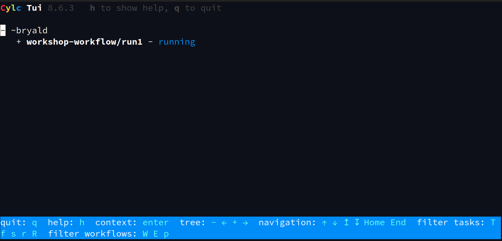


#### Cylc GUI

The Cylc GUI can be opened by running `cylc gui` (as long as you have used the `-X` flag when SSHing to the server), it will open up in a browser.

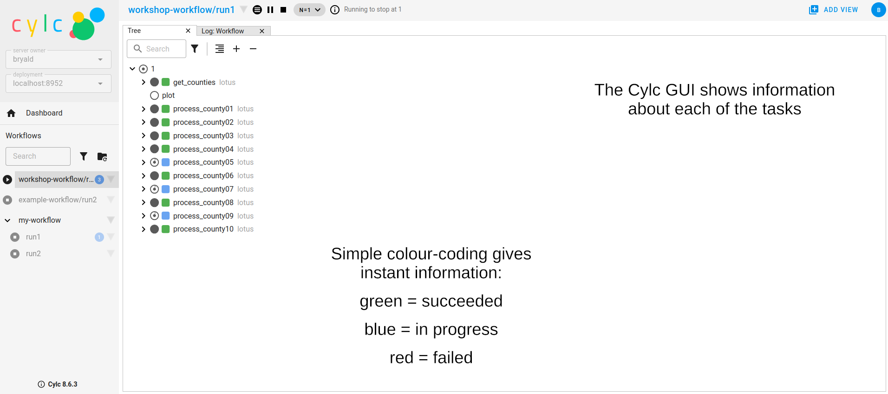

You can select either a list view (as above) or a graph view (below) of the workflow.

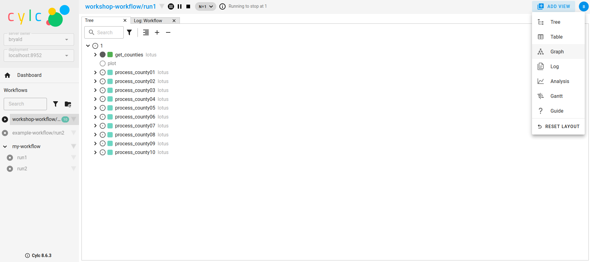

The graph view shows each of the tasks and the dependency graph that connects them.

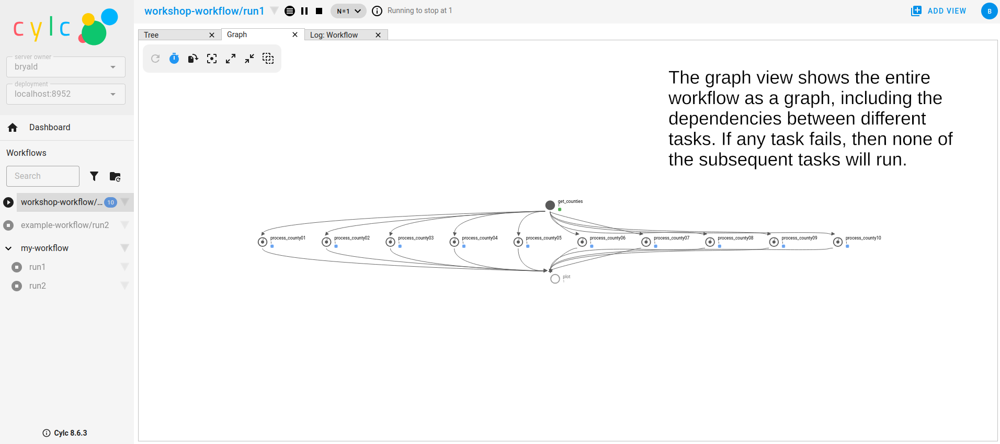

Failed tasks are clearly indicated in red. To emulate this failure, you can edit the `flow.cylc` file and change the `command` for the `clone_repo` task to something that will fail, for example:

```
    [[clone_repo]]
        script = """rm -fr workshop-repo
git clone https://github.com/cedadev/jasmin-workshop workshop-repo
cp workshop-repo/tutorials/tut02/code/* ${CYLC_WORKFLOW_RUN_DIR}/
rm -fr workshop-repo
exit 1""" # <-- Added exit 1 to emulate failure
```

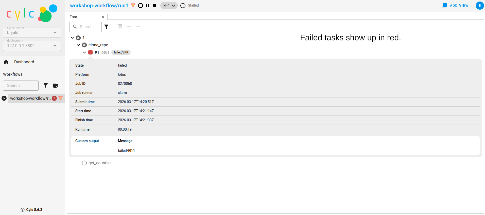

Click on the menu button at the top for more options.

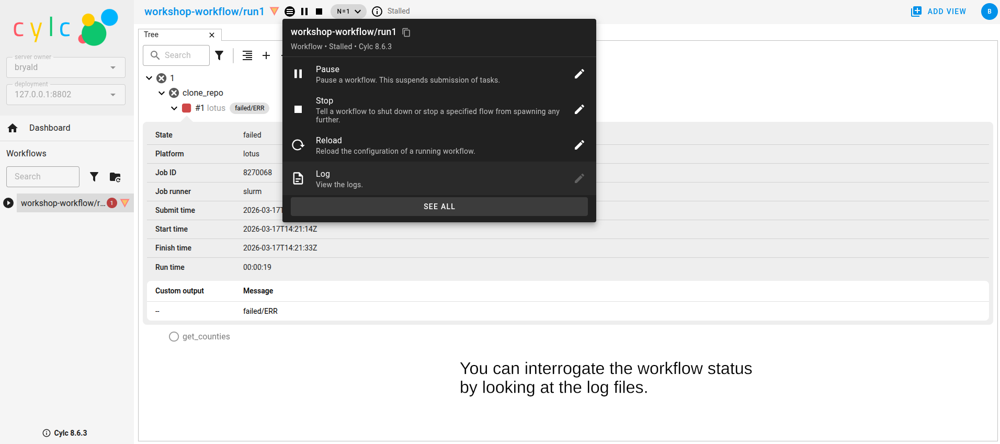

Each of the tasks has a log file that can be viewed within the GUI. By default, opening the logs will show the log for the entire workflow.

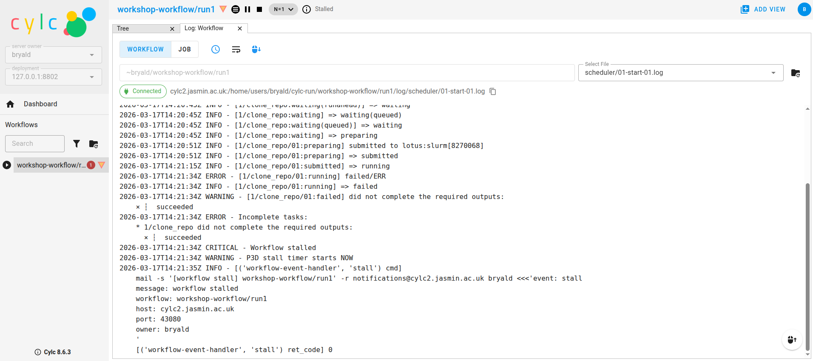

You can opt to view the specific job logs by selecting the `JOB` tab instead of the default `WORKFLOW` tab, then, enter the `<CYCLE>/<TASK>` in the search box to get the logs corresponding to that task, in this case `1/clone_repo`.

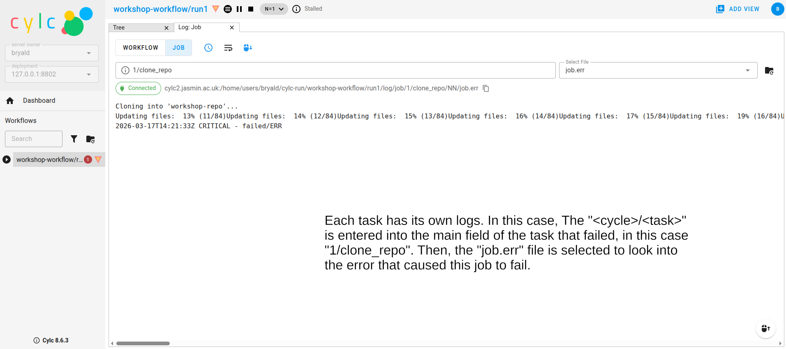

### Details of alternative approaches and best practice

> 1. Manage the process yourself (without Cylc)?

  * Pros:
    * You don't need to learn/configure Cylc
  * Cons:
    * You have to check the dependency tree yourself:
      * You need to check whether all tasks have run in a given stage before progressing to the next stage.
      * With Cylc you can configure complex rules for responding to failures and retrying tasks.

> 2. Set the `$PATH` environment variable in your `~/.bash_profile`

  * In order to find the Cylc variables we needed to change the `$PATH` as follows:
  
      ```
      # Add the location of the cylc executables to $PATH
      export PATH=/apps/jasmin/metomi/bin:$PATH
      ```

  * You can put the following lines in your `~/.bash_profile` file so that this will happen
    automatically when you login to the cylc server:

      ```
      if [[ $HOSTNAME = "cylc2.jasmin.ac.uk" ]]; then
          # NOTE: "cylc" is an alias to the "cylc2" server
          export PATH=/apps/jasmin/metomi/bin:$PATH
      fi
      ```

> 3. Write your outputs somewhere else

  * You might write outputs directly to a Group Workspace
  * You might write outputs to the default working directory for a task:
    * These are symbolically linked to the JASMIN `/work/scratch-pw/$USER` area.
    * See more details in the Cylc documentation:
      https://cylc.github.io/cylc-doc/stable/html/workflow-design-guide/general-principles.html#self-contained-workflows

> 4. *Have any files been accidentally left on the system?* (e.g. in: `/tmp/` etc)

  * Running a Cylc workflow will copy your workflow to a "run workflow directory" under:
  
        $HOME/cylc-run/<WORKFLOW>/runN/

  * This directory includes various files, directories and symbolic links related to your job. 
    Please check that you are not writing big files to that the directory and monitor the size 
    of the outputs.

> 5. Tidy up your run workflow directory (i.e. logs and task directories)

  * You can tell Cylc to tidy up (clear out) any logs and task directories by using the command:
  
      ```
      cylc clean <WORKFLOW>
      ```

> 6. View the workflow graph of the workflow

  * View the workflow graph of the workflow:
    * To view the workflow graph of your workflow without running it in the browser, use:
  
      ```
      cylc graph '<WORKFLOW>'
      # Where <WORKFLOW> is the name of the workflow directory
      ```

    * NOTE: this will only open and visualise the workflow graph in a browser and will not run the workflow.
      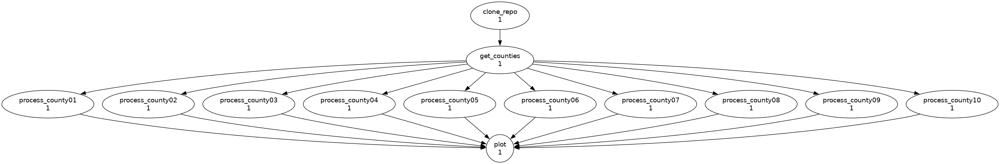

> 7. Understand different modes of stopping a running workflow

  * Understand different modes of stopping a running workflow:
    * If you need to stop a workflow that is running you can use:

      ```
      cylc stop '<WORKFLOW>'
      # Where <WORKFLOW> is the name of the workflow directory
      ```

    * The `cylc stop` command may not stop the workflow immediately - because it will wait 
      for submitted and running tasks to complete.

    * To kill the submitted and running tasks before stopping the workflow, use:

      ```
      cylc stop --kill '<WORKFLOW>'
      ```

    * To stop the workflow regardless of submitted and running tasks, use:

      ```
      cylc stop --now '<WORKFLOW>'
      ```

### Review and further info

This tutorial demonstrates how to:
  * Use the Cylc workflow management tool.
  * Construct a Cylc workflow involving a multi-step workflow.
  * Configure a Cylc workflow to work with the LOTUS batch cluster on JASMIN.
  * Run a Cylc workflow and monitor its progress using the Cylc GUI.

Cylc is a very versatile tool. We recommend that you study the documentation at:
  * Cylc: https://cylc.github.io/cylc-doc/stable/html/
