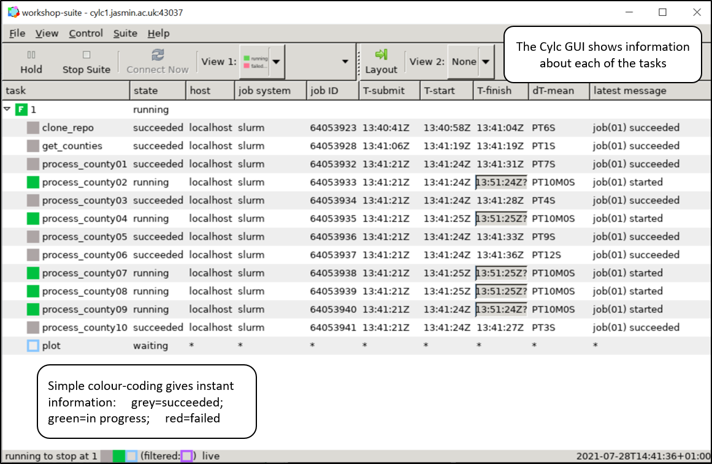
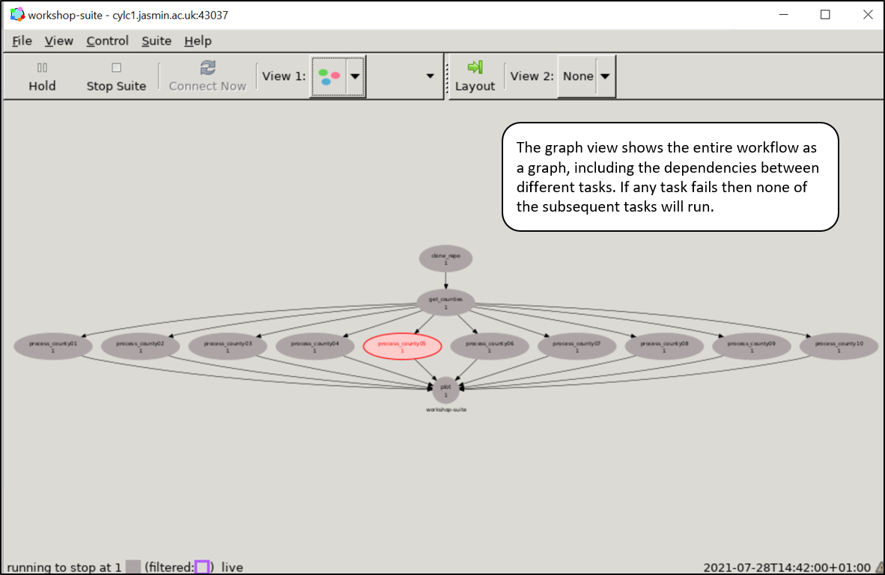

# Tutorial 02: Managing a multi-step workflow

### Scenario

I want to analyse a set of historical temperature records from weather stations in the UK. I am interested in calculating annual maximum temperatures for a randomly selected set of 10 counties. These are available from the publicly available "MIDAS-Open" data set in the CEDA archive. There are multiple steps to my workflow so I want to use a tool that (1) can work with LOTUS and (2) can handle dependencies (i.e. only run subsequent tasks if previous tasks have successfully completed).

I will read data from the MIDAS-Open dataset and aggregate all measurements (from all stations) into a time series of the annual maximum temperatures per county. Then plot a line graph to compare the annual maximum temperature from all counties and write it to a PNG file.

An example temperature file for a single station and year (in the MIDAS-Open data set) can be found at:

        /badc/ukmo-midas-open/data/uk-daily-temperature-obs/dataset-version-201901/
        devon/01359_cheldon-barton/qc-version-1/
        midas-open_uk-daily-temperature-obs_dv-
        201901_devon_01359_cheldon-barton_qcv-1_1977.csv

This workflow will generate a graph of a time series of maximum temperature data that looks something like:


### Workflow context

This tutorial follows a classic "diamond" structure as follows:


The **(1)** initialisation tasks must be completed first. 

The **(2)** individual batch tasks will then all run in parallel. 

When they have all completed then the **(3)** finalisation task can be executed.

The actual tasks are:

  1. **Initialisation**: Clone the repository to get the extraction scripts; run the first script 
     to generate a list of UK counties; write those to a text file.

  2. **Batch**: For each county: calculate a 2000-2017 time series of the annual maximum 
     temperature across all stations.

  3. **Finalisation**: Read in all the time series files and plot them on a line graph to a PNG file.

It may help to sketch out the process in a simple diagram, as shown here...


### Objectives
 
After completing this tutorial I will be able to:

 * break down a multi-step workflow into independent tasks
 * configure a basic Rose/Cylc job that includes a multi-step workflow
 * run the workflow on the `cylc` server on JASMIN
 * interact with the Cylc graphical user interface

### JASMIN resources

 * JASMIN account with SSH public key uploaded and `jasmin-login` privilege
 * login servers: `login[1-4].jasmin.ac.uk`
 * Cylc server: `cylc.jasmin.ac.uk`
 * LOTUS batch processing cluster
 * GWS (read/write): `/gws/pw/j05/workshop`
 * `$HOME` directory
 * CEDA Archive (read-only): requires a CEDA account
 * help documentation at https://help.jasmin.ac.uk
 
### Local resources

* SSH client (to login to JASMIN)

### The task

This is the outline of the overall task. The recommended way of doing each step is covered in the "Walkthrough" below.

 1. The starting point is on a JASMIN `login` server (see [exercise 01](../ex01))
 1. SSH to the Rose & Cylc server (with the `-X` flag to forward X-windows)
 1. In this example you are given the building blocks to construct a "suite file" for use with Rose & Cylc
 1. Wrap the scripts in a Rose suite by copying the example suite to a new directory called `my-suite` and modifying it
 1. Run the Rose suite
 1. If the suite partially runs and leaves log/working directories in place you can clean these up and run it again
 1. If you need to stop the suite then you can instruct Cylc to stop it

### Review / alternative approaches / best practice

Alternative approaches and good practice might include:
 * Manage the process yourself (without Rose and Cylc)?
 * Set the `$PATH` environment variable in your `~/.bash_profile`
 * Write your outputs somewhere else
 * *Have any files been accidentally left on the system?* (e.g. in: `/tmp/` etc)
 * Tidy up your run suite directory (i.e. logs and task directories)
 * View the workflow graph of the suite
 * Understand different modes of stopping a running suite

### Walkthrough

1. The starting point is on a JASMIN `login` server (see [exercise 01](../ex01))

2. SSH to the Rose & Cylc server (with the `-X` flag to forward X-windows)
   
      ```
      ssh -X cylc
      ```

3. In this example you are given the building blocks to construct a "suite file" for use with Rose & Cylc

  * Script 1: `create-counties-file.py`
    1. Context: Python 3
    2. Inputs: None - script locates county directories in the CEDA Archive
    3. Outputs:
       * File: `./outputs/counties.txt`

  * Script 2: `extract-annual-max-series.py`
    1. Context: Python 3
    2. Inputs: index - to select a county from the list (a number between 1 and 10)
    3. Outputs:
       * Files [10]: `./outputs/<county>.csv`

  * Script 3: `plot-county-temps.py`
    1. Context: Python 3
    2. Inputs: None - script locates input data in the `./outputs/` directory
    3. Outputs:
       * File: `./outputs/annual-max-temp-time-series.png`

  * The scripts are available at:
    * On JASMIN: `/gws/pw/j05/workshop/tutorials/tut02/code/`
    * On github: https://github.com/cedadev/jasmin-workshop/tree/master/tutorials/tut02/code

4. Wrap the scripts in a Rose suite by copying the example suite to a new directory called
   `my-suite` and modifying it.

  * The example suite is available at:

        /gws/pw/j05/workshop/tutorials/tut02/example-suite

  * Go to the directory where you have copied the suite.

  * You can run the example suite to view how it works, with:

    ```
    # Add the location of the rose/cylc executables to $PATH
    export PATH=/apps/jasmin/metomi/bin:$PATH
    rose suite-run
    ```

  * All of the scripts operate on input/output data in the relative directory: `./outputs`. It
    therefore makes sense to copy the Python scripts to the main suite "run directory" and 
    ensure that each task runs from that directory. The suite run directory is specified by 
    the Cylc environment variable: `$CYLC_SUITE_RUN_DIR`.

    This variable is set for you by Cylc; a typical value would be 
    `/home/users/$USER/cylc-run/my-suite`. Note that the current working directory for the 
    individual steps is different for each step (for example 
    `/home/users/$USER/cylc-run/my-suite/work/1/initialise` for the `initialise` step). For the 
    workflow below, it is convenient for all steps to be run in the same directory, so the commands 
    for each step will include changing directory to `$CYLC_SUITE_RUN_DIR` before running the 
    relevant script.


  * Edit the `suite.rc` file as follows:
    * In the `[[runtime]]` section of the suite file, modify each of the 4 processing steps as follows:

        * `[[initialise]]`
          1. Delete any existing `jasmin-workshop` sub-directory (in case the suite has 
             been run previously)
          2. Clone the GitHub repository: https://github.com/cedadev/jasmin-workshop
          3. Copy the files in the sub-directory `jasmin-workshop/tutorials/tut02/code/` to the 
             suite run directory at: `$CYLC_SUITE_RUN_DIR`

        * `[[step1]]`
          1. Delete any existing `outputs` sub-directory (in case the suite has been run 
             previously)
          2. Activate the standard JASMIN Python 3 environment.
          3. Change directory to the `$CYLC_SUITE_RUN_DIR`
          4. Run the script

        * `[[batch<counter>]]`
          1. Activate the standard JASMIN Python 3 environment.
          2. Change directory to the `$CYLC_SUITE_RUN_DIR`
          3. Run the script for each value of the `counter`:
             * The `counter` variable is accessible by the environment variable: `CYLC_TASK_PARAM_counter`

        * `[[final]]`
          1. Activate the standard JASMIN Python 3 environment.
          2. Change directory to the `$CYLC_SUITE_RUN_DIR`
          3. Run the script

5. Run the Rose suite with the command:

    ```
    export PATH=/apps/jasmin/metomi/bin:$PATH
    rose suite-run
    ```

  * **NOTE:** It will take a couple of minutes to start up and then a GUI should appear that 
    shows the workflow in action.

6. If the suite partially runs and leaves log/working directories in place you can clean these up and run it again with:

    ```
    rose suite-run --new
    ```

7. If you need to stop the suite then you can instruct Cylc to stop it with:
   
    ```
    cylc stop '<SUITE>'
    # Where <SUITE> is the name of the suite directory
    ```

### What should the Cylc GUI look like?

Here is a quick walkthrough of what you should see in the GUI if the job runs successfully. 
Note that in this example the 4 tasks have been renamed to:
 * `clone_repo`
 * `get_counties`
 * `process<county>`
 * `plot`

The full example suite is available at:

        /gws/pw/j05/workshop/tutorials/tut02/workshop-suite

And on github at:

  https://github.com/cedadev/jasmin-workshop/tree/master/tutorials/tut02/workshop-suite

The Cylc GUI opens when you start running a suite (as long as you have used the `-X` flag when SSHing to the server).



You can select either a list view (as above) or a graph view (below) of the workflow.


The graph view shows each of the tasks and the dependency graph that connects them.



Failed tasks are clearly indicated in red.


Right-click on a failed task in order to view more information.


Each of the log files can be viewed within the GUI.


### Details of alternative approaches and best practice

> 1. Manage the process yourself (without Rose and Cylc)?

  * Pros:
    * You don't need to learn/configure Rose and Cylc
  * Cons:
    * You have to check the dependency tree yourself:
      * You need to check whether all tasks have run in a given stage before progressing to the next stage.
      * With Rose and Cylc you can configure complex rules for responding to failures and retrying tasks.

> 2. Set the `$PATH` environment variable in your `~/.bash_profile`

  * In order to find the Rose/Cylc variables we needed to change the `$PATH` as follows:
  
      ```
      # Add the location of the rose/cylc executables to $PATH
      export PATH=/apps/jasmin/metomi/bin:$PATH
      ```

  * You can put the following lines in your `~/.bash_profile` file so that this will happen
    automatically when you login to the cylc server:

      ```
      if [[ $HOSTNAME = "cylc1.jasmin.ac.uk" ]]; then
          # NOTE: "cylc" is an alias to the "cylc1" server
          export PATH=/apps/jasmin/metomi/bin:$PATH
      fi
      ```

> 3. Write your outputs somewhere else

  * You might write outputs directly to a Group Workspace
  * You might write outputs to the default working directory for a task:
    * These are symbolically linked to the global `/work/scratch/$USER` area.
    * See more details in the Rose documentation:
      https://metomi.github.io/rose/doc/html/tutorial/cylc/runtime/introduction.html#where-do-all-the-files-go

> 4. *Have any files been accidentally left on the system?* (e.g. in: `/tmp/` etc)

  * Running a Rose suite will copy your suite to a "run suite directory" under:
  
        $HOME/cylc-run/<SUITE>/

  * This directory includes various files, directories and symbolic links related to your job. 
    Please check that you are not writing big files to that the directory and monitor the size 
    of the outputs.

> 5. Tidy up your run suite directory (i.e. logs and task directories)

  * You can tell Rose to tidy up (clear out) any logs and task directories by using the command:
  
      ```
      rose suite-clean
      ```

> 6. View the workflow graph of the suite

  * View the workflow graph of the suite:
    * To view the workflow graph of your suite without running it, use:
  
      ```
      rose suite-run -i
      cylc graph '<SUITE>'
      # Where <SUITE> is the name of the suite directory
      ```

    * NOTE: the `-i` option means "install only" - so this will not run the suite.
      

> 7. Understand different modes of stopping a running suite

  * Understand different modes of stopping a running suite:
    * If you need to stop a suite that is running you can use:

      ```
      cylc stop '<SUITE>'
      # Where <SUITE> is the name of the suite directory
      ```

    * The `cylc stop` command may not stop the suite immediately - because it will wait 
      for submitted and running tasks to complete.

    * To kill the submitted and running tasks before stopping the suite, use:

      ```
      cylc stop --kill '<SUITE>'
      ```

    * To stop the suite regardless of submitted and running tasks, use:

      ```
      cylc stop --now '<SUITE>'
      ```

### Review and further info

This tutorial demonstrates how to:
  * Use the Rose and Cylc workflow management tools.
  * Construct a Rose suite involving a multi-step workflow.
  * Configure a Rose suite to work with the LOTUS batch cluster on JASMIN.
  * Run a Rose suite and monitor its progress using the Cylc GUI.

Rose and Cylc are very versatile tools. We recommend that you study the documentation at:
  * Rose: https://metomi.github.io/rose/doc/html/ 
  * Cylc: https://cylc.github.io/doc/built-sphinx/
